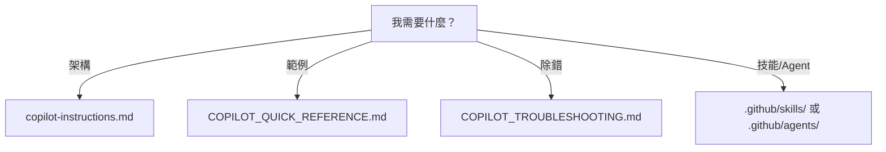

# GitHub Copilot Knowledge Base Index

> **快速導航 - 為 AI 助手與開發者設計**

---

## 🎯 必讀核心文件

| 資源 | 用途 | 優先級 |
|------|------|--------|
| [copilot-instructions.md](.github/copilot-instructions.md) | **架構規則與限制** | ⭐⭐⭐ |
| [AGENTS.md](AGENTS.md) | AI 代理上下文 | ⭐⭐⭐ |
| [forbidden-copilot-instructions.md](.github/forbidden-copilot-instructions.md) | 禁止修改規則 | ⭐⭐⭐ |

---
# Copilot 知識庫索引（精簡）

— 以規則句與極簡流程圖為主，快速導向最重要檔案 —

## 一行規則
- 架構與層界：`copilot-instructions.md`
- 範例與速查：`COPILOT_QUICK_REFERENCE.md`
- 除錯與排查：`COPILOT_TROUBLESHOOTING.md`

## 極簡決策圖



## 常用連結（一行）
- 架構：`.github/copilot-instructions.md`
- 快速參考：`.github/COPILOT_QUICK_REFERENCE.md`
- 排查：`.github/COPILOT_TROUBLESHOOTING.md`
- Skills/Agents：`.github/skills/`、`.github/agents/`

最後更新：2026-01-28
- **[Playwright Tests](./prompts/playwright-generate-test.prompt.md)** - E2E tests
- **[Review & Refactor](./prompts/review-and-refactor.prompt.md)** - Code review

### Workflows

- **[GitHub Action Workflow](./prompts/create-github-action-workflow-specification.prompt.md)** - CI/CD specs
- **[Project Workflow Analysis](./prompts/project-workflow-analysis-blueprint-generator.prompt.md)** - Workflow blueprints

---

## 🤖 Custom Agents

Specialized agents for specific tasks, located in `.github/agents/`:

| Agent | Purpose | Use When |
|-------|---------|----------|
| [GPT-5.2-Codex](.github/agents/GPT-5.2-Codex-v1_EN-specialized.agent.md) | Angular 20 + DDD + NgRx Signals | Main development |
| [GPT-5.1-Codex-Max-v6](.github/agents/GPT-5.1-Codex-Max-v6_EN-specialized.agent.md) | Unified DDD + Firebase | Alternative |
| [4.1-Beast](.github/agents/4.1-Beast.agent.md) | GPT-4.1 coding agent | Code generation |
| [Planner](.github/agents/planner.agent.md) | Strategic planning | Architecture decisions |
| [Arch](.github/agents/arch.agent.md) | Architecture design | System design |
| [Janitor](.github/agents/janitor.agent.md) | Code cleanup | Tech debt |
| [Context7](.github/agents/context7.agent.md) | Latest library docs | Research |

---

## 📋 Collections

Task-oriented collections in `.github/collections/`:

| Collection | Focus |
|------------|-------|
| [Security Best Practices](./collections/security-best-practices.md) | Security guidelines |
| [Project Planning](./collections/project-planning.md) | Planning workflows |
| [Technical Spike](./collections/technical-spike.md) | Research tasks |
| [Testing Automation](./collections/testing-automation.md) | Test workflows |
| [Software Engineering Team](./collections/software-engineering-team.md) | Team processes |
| [Edge AI Tasks](./collections/edge-ai-tasks.md) | AI-specific tasks |

---

## 🗺️ Layer Mapping

The [project-layer-mapping.yml](.github/project-layer-mapping.yml) defines the DDD layer structure:

```yaml
domain:       src/app/core/**/models
application:  src/app/core/**/stores
infrastructure: src/app/core/**/services
interface:    src/app/features/**
```

---

## 🚫 Forbidden Patterns

Critical rules from [forbidden-copilot-instructions.md](.github/forbidden-copilot-instructions.md):

- ❌ **Never modify**: `src/index.html`, `src/dataconnect-generated/**`
- ❌ **Never use**: Traditional NgRx (actions/reducers/effects)
- ❌ **Never use**: Zone.js dependencies
- ❌ **Never use**: Legacy control flow (`*ngIf`, `*ngFor`, `*ngSwitch`)

---

## 🎯 Quick Task Reference

### Need to...

| Task | Resources to Check |
|------|--------------------|
| Create a new feature | [DDD Architecture](./instructions/ng-ddd-architecture.instructions.md) + [NgRx Signals](./instructions/ngrx-signals.instructions.md) |
| Add state management | [NgRx Signals Skill](.github/skills/@ngrx-signals/) + [Instructions](./instructions/ngrx-signals.instructions.md) |
| Integrate Firebase | [AngularFire Skill](.github/skills/angularfire/) + [Instructions](./instructions/ng-angularfire.instructions.md) |
| Update UI components | [Angular Material Skill](.github/skills/angular-material/) + [Control Flow](./instructions/ng-angular-20-control-flow.instructions.md) |
| Write tests | [Webapp Testing Skill](.github/skills/webapp-testing/) + [Breakdown Test Prompt](./prompts/breakdown-test.prompt.md) |
| Plan architecture | [Arch Agent](.github/agents/arch.agent.md) + [Create ADR Prompt](./prompts/create-architectural-decision-record.prompt.md) |
| Clean up code | [Janitor Agent](.github/agents/janitor.agent.md) |
| Research libraries | [Context7 Agent](.github/agents/context7.agent.md) |

---

## 📖 Documentation Structure

```
docs/
├── DDD/                    # Domain-Driven Design docs
│   ├── GLOSSARY.md         # Terminology reference
│   ├── domain.md           # Domain layer
│   ├── application.md      # Application layer
│   ├── infrastructure.md   # Infrastructure layer
│   └── shared.md           # Shared utilities
├── ui/                     # UI specifications
│   ├── workspace-layout-spec/
│   └── switcher-ui-spec/
└── prd.md                  # Product requirements
```

---

## 🔧 Configuration Files

| File | Purpose |
|------|---------|
| [.github/copilot.yml](.github/copilot.yml) | Copilot behavior config |
| [.vscode/settings.json](.vscode/settings.json) | VS Code + Copilot settings |
| [.vscode/extensions.json](.vscode/extensions.json) | Recommended extensions |

---

## 📞 Getting Help

1. **For architecture questions**: Check [copilot-instructions.md](.github/copilot-instructions.md)
2. **For specific patterns**: Search [instructions/](.github/instructions/)
3. **For AI context**: Read [AGENTS.md](AGENTS.md)
4. **For tasks**: Browse [prompts/](.github/prompts/)
5. **For specialized work**: Use appropriate [agents/](.github/agents/)

---

**Last Updated**: 2026-01-17  
**Maintained By**: Project maintainers  
**Copilot Version**: Compatible with GitHub Copilot Chat and CLI
