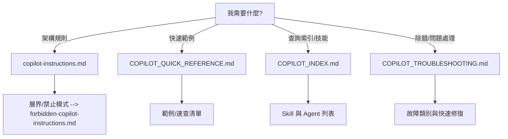

# GitHub Copilot Knowledge Base Index

> **快速導航 - 為 AI 助手與開發者設計**

---

## 🎯 必讀核心文件

| 資源 | 用途 | 優先級 |
|------|------|--------|
| [copilot-instructions.md](.github/copilot-instructions.md) | **架構規則與限制** | ⭐⭐⭐ |
| [AGENTS.md](AGENTS.md) | AI 代理上下文 | ⭐⭐⭐ |
| [forbidden-copilot-instructions.md](.github/forbidden-copilot-instructions.md) | 禁止修改規則 | ⭐⭐⭐ |

---

## 🧭 決策樹 (快速判斷應該看哪個文件)



短則規則:
- 若要「架構/邊界」優先打開 `copilot-instructions.md`。
- 若要「一秒解法或範本」打開 `COPILOT_QUICK_REFERENCE.md`。
- 若要找 Agent/Skill/Prompt，打開 `COPILOT_INDEX.md`。
- 若遇到 Copilot 建議錯誤或無回應，先看 `COPILOT_TROUBLESHOOTING.md`。


## 📂 指令檔案組織

### 架構與設計模式
- **[DDD Architecture](./instructions/ng-ddd-architecture.instructions.md)** - Domain-driven design
- **[Project Structure](./instructions/project-structure.instructions.md)** - 檔案組織與命名
- **[NgRx Signals](./instructions/ngrx-signals.instructions.md)** - 狀態管理

### Angular 框架
- **[Angular Core](./instructions/angular.instructions.md)** - 通用最佳實踐
- **[Angular 20 Control Flow](./instructions/ng-angular-20-control-flow.instructions.md)** - `@if/@for/@switch`
- **[Angular Material](./instructions/ng-angular-material.instructions.md)** - Material Design
- **[Angular Router](./instructions/ng-angular-router.instructions.md)** - 路由與導航
- **[Angular Forms](./instructions/ng-angular-forms.instructions.md)** - Reactive Forms

### Firebase 整合
- **[AngularFire](./instructions/ng-angularfire.instructions.md)** - Firebase 整合
- **[Firebase Data Connect](./instructions/ng-firebase-data-connect.instructions.md)** - GraphQL

### 程式碼品質
- **[TypeScript](./instructions/typescript-5-es2022.instructions.md)** - TS 標準
- **[RxJS Patterns](./instructions/ng-rxjs-patterns.instructions.md)** - Reactive 程式設計
- **[Security & OWASP](./instructions/security-and-owasp.instructions.md)** - 安全最佳實踐
- **[Performance](./instructions/performance-optimization.instructions.md)** - 效能優化

---

## 🎨 技能 (Skills)

自動根據上下文載入，位於 `.github/skills/`

### 框架技能
- **[@ngrx/signals](.github/skills/@ngrx-signals/)** - Signal 狀態管理
- **[Angular 20](.github/skills/angular-20/)** - Angular 20 功能
- **[Angular Material](.github/skills/angular-material/)** - Material 元件
- **[AngularFire](.github/skills/angularfire/)** - Firebase 整合

### 設計與架構
- **[DDD Architecture](.github/skills/ddd-architecture/)** - 領域驅動設計
- **[Material Design 3](.github/skills/material-design-3/)** - MD3 主題

---

## 💬 提示模板 (Prompts)

位於 `.github/prompts/`

### 規劃與架構
- `breakdown-epic-arch.prompt.md` - 架構規劃
- `create-architectural-decision-record.prompt.md` - ADR 建立
- `create-specification.prompt.md` - 規格文件

### 實作
- `create-implementation-plan.prompt.md` - 實作計畫
- `breakdown-feature-implementation.prompt.md` - 功能拆解

### 測試
- `breakdown-test.prompt.md` - 測試規劃
- `playwright-generate-test.prompt.md` - E2E 測試

---

## 🤖 自訂代理 (Agents)

位於 `.github/agents/`

- **GPT-5.2-Codex** - Angular 20 + DDD + NgRx Signals 主力開發
- **Planner** - 策略規劃
- **Arch** - 架構設計
- **Janitor** - 程式碼清理
- **Context7** - 最新函式庫文件

---

## 🚫 禁止模式

來自 [forbidden-copilot-instructions.md](.github/forbidden-copilot-instructions.md):

- ❌ **永不修改**: `src/index.html`, `src/dataconnect-generated/**`
- ❌ **永不使用**: Traditional NgRx (actions/reducers/effects)
- ❌ **永不使用**: Zone.js 依賴
- ❌ **永不使用**: Legacy control flow (`*ngIf`, `*ngFor`, `*ngSwitch`)

---

## 🎯 快速任務參考

| 任務 | 參考資源 |
|------|----------|
| 新增功能 | DDD Architecture + NgRx Signals |
| 狀態管理 | @ngrx/signals Skill + Instructions |
| Firebase 整合 | AngularFire Skill + Instructions |
| UI 元件 | Angular Material + Control Flow |
| 撰寫測試 | Webapp Testing + Breakdown Test Prompt |
| 架構規劃 | Arch Agent + Create ADR Prompt |

---

**最後更新**: 2026-01-28  
**維護者**: Project maintainers

| Skill | Description | Triggers |
|-------|-------------|----------|
| [@ngrx/signals](.github/skills/@ngrx-signals/) | Signal-based state | Store development |
| [RxJS Patterns](.github/skills/rxjs-patterns/) | Reactive patterns | Observable usage |

### Firebase Skills

| Skill | Description | Triggers |
|-------|-------------|----------|
| [AngularFire](.github/skills/angularfire/) | Firebase integration | Firebase work |
| [Firebase Data Connect](.github/skills/firebase-data-connect/) | GraphQL + Firebase | Data Connect |

### Design & Architecture Skills

| Skill | Description | Triggers |
|-------|-------------|----------|
| [DDD Architecture](.github/skills/ddd-architecture/) | Domain-driven design | Architecture work |
| [Material Design 3](.github/skills/material-design-3/) | MD3 theming | Design system |

### Development Tools Skills

| Skill | Description | Triggers |
|-------|-------------|----------|
| [Black-Tortoise UI Reviewer](.github/skills/web-design-reviewer/) | Black-Tortoise UI review and fixes | UI/layout/design review |
| [Webapp Testing](.github/skills/webapp-testing/) | Playwright testing | E2E testing |
| [VS Code Extensions](.github/skills/vscode-ext-commands/) | Extension development | VS Code work |

---

## 💬 Prompt Templates

Reusable prompts for common tasks, located in `.github/prompts/`:

### Planning & Architecture

- **[Breakdown Epic (Arch)](./prompts/breakdown-epic-arch.prompt.md)** - Architecture planning
- **[Breakdown Epic (PM)](./prompts/breakdown-epic-pm.prompt.md)** - Product planning
- **[Create ADR](./prompts/create-architectural-decision-record.prompt.md)** - Architecture decisions
- **[Create Specification](./prompts/create-specification.prompt.md)** - Spec documents

### Documentation

- **[Create README](./prompts/create-readme.prompt.md)** - README generation
- **[Create AGENTS.md](./prompts/create-agentsmd.prompt.md)** - Agent context
- **[Documentation Writer](./prompts/documentation-writer.prompt.md)** - General docs
- **[Update Specification](./prompts/update-specification.prompt.md)** - Spec updates

### Implementation

- **[Implementation Plan](./prompts/create-implementation-plan.prompt.md)** - Create plans
- **[Update Implementation Plan](./prompts/update-implementation-plan.prompt.md)** - Update plans
- **[Breakdown Feature](./prompts/breakdown-feature-implementation.prompt.md)** - Feature breakdown
- **[Structured Autonomy](./prompts/structured-autonomy-generate.prompt.md)** - Autonomous tasks

### Testing & Quality

- **[Breakdown Test](./prompts/breakdown-test.prompt.md)** - Test planning
- **[Playwright Tests](./prompts/playwright-generate-test.prompt.md)** - E2E tests
- **[Review & Refactor](./prompts/review-and-refactor.prompt.md)** - Code review

### Workflows

- **[GitHub Action Workflow](./prompts/create-github-action-workflow-specification.prompt.md)** - CI/CD specs
- **[Project Workflow Analysis](./prompts/project-workflow-analysis-blueprint-generator.prompt.md)** - Workflow blueprints

---

## 🤖 Custom Agents

Specialized agents for specific tasks, located in `.github/agents/`:

| Agent | Purpose | Use When |
|-------|---------|----------|
| [GPT-5.2-Codex](.github/agents/GPT-5.2-Codex-v1_EN-specialized.agent.md) | Angular 20 + DDD + NgRx Signals | Main development |
| [GPT-5.1-Codex-Max-v6](.github/agents/GPT-5.1-Codex-Max-v6_EN-specialized.agent.md) | Unified DDD + Firebase | Alternative |
| [4.1-Beast](.github/agents/4.1-Beast.agent.md) | GPT-4.1 coding agent | Code generation |
| [Planner](.github/agents/planner.agent.md) | Strategic planning | Architecture decisions |
| [Arch](.github/agents/arch.agent.md) | Architecture design | System design |
| [Janitor](.github/agents/janitor.agent.md) | Code cleanup | Tech debt |
| [Context7](.github/agents/context7.agent.md) | Latest library docs | Research |

---

## 📋 Collections

Task-oriented collections in `.github/collections/`:

| Collection | Focus |
|------------|-------|
| [Security Best Practices](./collections/security-best-practices.md) | Security guidelines |
| [Project Planning](./collections/project-planning.md) | Planning workflows |
| [Technical Spike](./collections/technical-spike.md) | Research tasks |
| [Testing Automation](./collections/testing-automation.md) | Test workflows |
| [Software Engineering Team](./collections/software-engineering-team.md) | Team processes |
| [Edge AI Tasks](./collections/edge-ai-tasks.md) | AI-specific tasks |

---

## 🗺️ Layer Mapping

The [project-layer-mapping.yml](.github/project-layer-mapping.yml) defines the DDD layer structure:

```yaml
domain:       src/app/core/**/models
application:  src/app/core/**/stores
infrastructure: src/app/core/**/services
interface:    src/app/features/**
```

---

## 🚫 Forbidden Patterns

Critical rules from [forbidden-copilot-instructions.md](.github/forbidden-copilot-instructions.md):

- ❌ **Never modify**: `src/index.html`, `src/dataconnect-generated/**`
- ❌ **Never use**: Traditional NgRx (actions/reducers/effects)
- ❌ **Never use**: Zone.js dependencies
- ❌ **Never use**: Legacy control flow (`*ngIf`, `*ngFor`, `*ngSwitch`)

---

## 🎯 Quick Task Reference

### Need to...

| Task | Resources to Check |
|------|--------------------|
| Create a new feature | [DDD Architecture](./instructions/ng-ddd-architecture.instructions.md) + [NgRx Signals](./instructions/ngrx-signals.instructions.md) |
| Add state management | [NgRx Signals Skill](.github/skills/@ngrx-signals/) + [Instructions](./instructions/ngrx-signals.instructions.md) |
| Integrate Firebase | [AngularFire Skill](.github/skills/angularfire/) + [Instructions](./instructions/ng-angularfire.instructions.md) |
| Update UI components | [Angular Material Skill](.github/skills/angular-material/) + [Control Flow](./instructions/ng-angular-20-control-flow.instructions.md) |
| Write tests | [Webapp Testing Skill](.github/skills/webapp-testing/) + [Breakdown Test Prompt](./prompts/breakdown-test.prompt.md) |
| Plan architecture | [Arch Agent](.github/agents/arch.agent.md) + [Create ADR Prompt](./prompts/create-architectural-decision-record.prompt.md) |
| Clean up code | [Janitor Agent](.github/agents/janitor.agent.md) |
| Research libraries | [Context7 Agent](.github/agents/context7.agent.md) |

---

## 📖 Documentation Structure

```
docs/
├── DDD/                    # Domain-Driven Design docs
│   ├── GLOSSARY.md         # Terminology reference
│   ├── domain.md           # Domain layer
│   ├── application.md      # Application layer
│   ├── infrastructure.md   # Infrastructure layer
│   └── shared.md           # Shared utilities
├── ui/                     # UI specifications
│   ├── workspace-layout-spec/
│   └── switcher-ui-spec/
└── prd.md                  # Product requirements
```

---

## 🔧 Configuration Files

| File | Purpose |
|------|---------|
| [.github/copilot.yml](.github/copilot.yml) | Copilot behavior config |
| [.vscode/settings.json](.vscode/settings.json) | VS Code + Copilot settings |
| [.vscode/extensions.json](.vscode/extensions.json) | Recommended extensions |

---

## 📞 Getting Help

1. **For architecture questions**: Check [copilot-instructions.md](.github/copilot-instructions.md)
2. **For specific patterns**: Search [instructions/](.github/instructions/)
3. **For AI context**: Read [AGENTS.md](AGENTS.md)
4. **For tasks**: Browse [prompts/](.github/prompts/)
5. **For specialized work**: Use appropriate [agents/](.github/agents/)

---

**Last Updated**: 2026-01-17  
**Maintained By**: Project maintainers  
**Copilot Version**: Compatible with GitHub Copilot Chat and CLI
