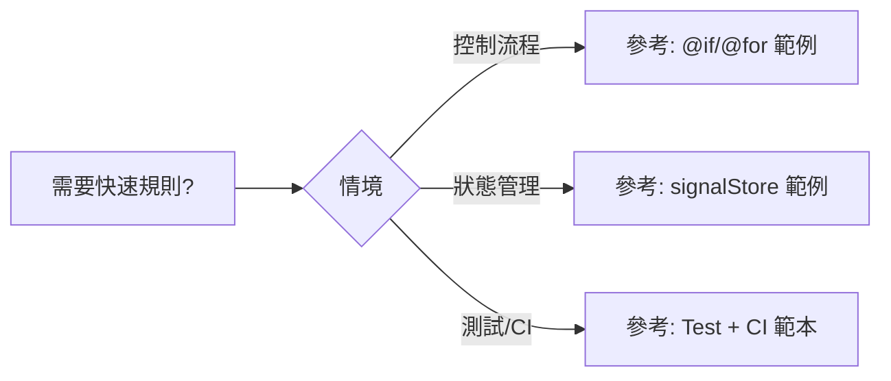

# Copilot Quick Reference

> **常用模式與指令速查**

---

## 🚀 基本指令

### Copilot Chat 對話
```bash
# 開始任務
/new 建立新的 workspace 功能,遵循 DDD 架構

# 架構指導
@workspace 新增領域實體應該如何組織結構?

# 程式碼審查
/fix 檢查此元件是否符合 Angular 20 最佳實踐

# 產生測試
/tests 為此 store 建立單元測試,使用 @ngrx/signals
```

---

## 📋 核心模式

### DDD 新功能架構

```typescript
// 1️⃣ Domain Layer (domain/entities/)
export interface WorkspaceEntity {
  id: string;
  name: string;
  // 純領域模型,無 UI 欄位
}

// 2️⃣ Application Layer (application/stores/)
export const WorkspaceStore = signalStore(
  { providedIn: 'root' },
  withState({ workspaces: [] }),
  withMethods((store, service = inject(WorkspaceService)) => ({
    load: rxMethod<void>(
      pipe(
        switchMap(() => service.get()),
        tapResponse({
          next: (ws) => patchState(store, { workspaces: ws }),
          error: (e) => console.error(e)
        })
      )
    )
  }))
);

// 3️⃣ Infrastructure Layer (infrastructure/services/)
@Injectable({ providedIn: 'root' })
export class WorkspaceService {
  private firestore = inject(Firestore);
  
  get(): Observable<Workspace[]> {
    // Firebase 邏輯
  }
}

// 4️⃣ Presentation Layer (presentation/components/)
@Component({
  standalone: true,
  template: `
    @if (store.workspaces(); as ws) {
      @for (w of ws; track w.id) {
        <div>{{ w.name }}</div>
      }
    }
  `
})
export class WorkspaceListComponent {
  store = inject(WorkspaceStore);
  
  ngOnInit() { this.store.load(); }
}
```

---

## ✅ 規則矩陣 (短句 DO / DON'T)

| 情境 | DO (短句) | DON'T (短句) |
|------|-----------|--------------|
| 控制流程 | 使用 `@if/@for/@switch` | 使用 `*ngIf/*ngFor/*ngSwitch` |
| 狀態管理 | 使用 `signalStore()` + `rxMethod()` | 使用傳統 `@ngrx/store` |
| 端到端 | 把業務放在 Domain/Application | 把業務放在 Component |
| 非同步 | 用 `rxMethod(...tapResponse(...))` | 直接 `.subscribe()` 在元件中 |



短則規則: 每條規則皆以 1-2 行短句呈現，便於 Copilot 拾取與內化。


## 🎯 Angular 20 Control Flow

```html
<!-- ✅ 使用現代語法 -->
@if (condition()) {
  <p>顯示內容</p>
} @else {
  <p>替代內容</p>
}

@for (item of items(); track item.id) {
  <div>{{ item.name }}</div>
}

@switch (status()) {
  @case ('active') { <span>啟用</span> }
  @case ('inactive') { <span>停用</span> }
  @default { <span>未知</span> }
}

<!-- ❌ 禁止使用 -->
<p *ngIf="condition">...</p>
<div *ngFor="let item of items">...</div>
```

---

## 🔧 NgRx Signals 狀態管理

```typescript
// Signal Store 基本結構
export const FeatureStore = signalStore(
  { providedIn: 'root' },
  
  // 狀態定義
  withState({ 
    items: [] as Item[],
    loading: false,
    error: null as string | null
  }),
  
  // 計算屬性
  withComputed((state) => ({
    count: computed(() => state.items().length)
  })),
  
  // 方法
  withMethods((store) => ({
    // 同步更新
    add: (item: Item) => {
      patchState(store, { 
        items: [...store.items(), item] 
      });
    },
    
    // 非同步操作
    load: rxMethod<void>(
      pipe(
        tap(() => patchState(store, { loading: true })),
        switchMap(() => service.getItems()),
        tapResponse({
          next: (items) => patchState(store, { 
            items, 
            loading: false 
          }),
          error: (error) => patchState(store, { 
            error: error.message,
            loading: false 
          })
        })
      )
    )
  }))
);
```

---

## 🚫 常見錯誤模式

| ❌ 錯誤 | ✅ 正確 |
|---------|---------|
| `*ngIf="condition"` | `@if (condition()) { }` |
| `*ngFor="let x of items"` | `@for (x of items(); track x.id) { }` |
| `createAction('@ngrx/store')` | `signalStore('@ngrx/signals')` |
| `.subscribe(data => ...)` | `rxMethod(...tapResponse(...))` |
| `@Component({})` | `@Component({ standalone: true })` |

---

## 📖 快速參考連結

- **架構規則**: [copilot-instructions.md](.github/copilot-instructions.md)
- **禁止項目**: [forbidden-copilot-instructions.md](.github/forbidden-copilot-instructions.md)
- **完整索引**: [COPILOT_INDEX.md](.github/COPILOT_INDEX.md)
- **Skills**: `.github/skills/`
- **Prompts**: `.github/prompts/`

---

**最後更新**: 2026-01-28
// ✅ DO: Use new control flow
@if (isLoading()) {
  <app-spinner />
} @else if (error()) {
  <app-error [message]="error()" />
} @else {
  <app-content [data]="data()" />
}

@for (item of items(); track item.id) {
  <app-item [item]="item" />
} @empty {
  <app-empty-state />
}

@switch (status()) {
  @case ('loading') {
    <app-spinner />
  }
  @case ('error') {
    <app-error />
  }
  @default {
    <app-content />
  }
}

// ❌ DON'T: Use legacy control flow
<div *ngIf="isLoading">...</div>
<div *ngFor="let item of items">...</div>
```

### Signal-Based State

```typescript
// ✅ DO: Use signals for state
export class MyComponent {
  // Writable signal
  count = signal(0);
  
  // Computed signal
  doubled = computed(() => this.count() * 2);
  
  // Effect for side effects
  constructor() {
    effect(() => {
      console.log('Count changed:', this.count());
    });
  }
  
  increment() {
    this.count.update(c => c + 1);
  }
}

// ❌ DON'T: Use traditional properties
export class MyComponent {
  count = 0;  // Not reactive
}
```

### NgRx Signals Store

```typescript
// ✅ DO: Use signalStore + rxMethod
export const MyStore = signalStore(
  { providedIn: 'root' },
  withState({ data: [], loading: false }),
  withComputed(({ data }) => ({
    count: computed(() => data().length)
  })),
  withMethods((store, service = inject(MyService)) => ({
    load: rxMethod<void>(
      pipe(
        tap(() => patchState(store, { loading: true })),
        switchMap(() => service.getData()),
        tapResponse({
          next: (data) => patchState(store, { data, loading: false }),
          error: (err) => patchState(store, { loading: false })
        })
      )
    )
  }))
);

// ❌ DON'T: Use traditional NgRx
// No @ngrx/store, @ngrx/effects, actions, reducers
```

---

## 🎯 Task Templates

### New Component Checklist

- [ ] Determine correct layer (domain/application/infrastructure/interface)
- [ ] Create component with standalone: true
- [ ] Use signal-based state
- [ ] Use @if/@for/@switch control flow
- [ ] Inject dependencies with inject()
- [ ] Add proper TypeScript types
- [ ] Follow naming conventions (kebab-case)
- [ ] Add JSDoc comments for public APIs
- [ ] Create unit tests

### New Store Checklist

- [ ] Use signalStore() from @ngrx/signals
- [ ] Define initial state with withState()
- [ ] Add computed signals with withComputed()
- [ ] Add methods with withMethods()
- [ ] Use rxMethod() for async operations
- [ ] Use patchState() for all mutations
- [ ] Use tapResponse() for error handling
- [ ] Add lifecycle hooks with withHooks()
- [ ] Create store tests

### Firebase Integration Checklist

- [ ] Create service in infrastructure layer
- [ ] Inject Firestore/Auth/Storage
- [ ] Return Observables (no .subscribe() in service)
- [ ] Handle errors properly
- [ ] Use Firebase converters for data transformation
- [ ] Test with Firebase emulator locally
- [ ] Add security rules

---

## 🔍 Finding the Right Resource

### I need to...

| Goal | Resource |
|------|----------|
| Understand project architecture | [README.md](../README.md) |
| Get AI context | [AGENTS.md](../AGENTS.md) |
| Learn DDD patterns | [DDD Instructions](./instructions/ng-ddd-architecture.instructions.md) |
| Learn NgRx Signals | [Signals Instructions](./instructions/ngrx-signals.instructions.md) |
| Use Angular Material | [Material Skill](./skills/angular-material/) |
| Integrate Firebase | [AngularFire Skill](./skills/angularfire/) |
| Write tests | [Webapp Testing Skill](./skills/webapp-testing/) |
| Plan a feature | [Breakdown Feature Prompt](./prompts/breakdown-feature-implementation.prompt.md) |
| Review architecture | [Arch Agent](./agents/arch.agent.md) |
| Clean up code | [Janitor Agent](./agents/janitor.agent.md) |

---

## ⚡ Performance Tips

### For Copilot

1. **Be specific** - "Create a workspace entity following DDD" vs "create a component"
2. **Use context** - Reference existing files with @filename
3. **Leverage skills** - Copilot loads skills automatically based on context
4. **Use prompts** - Pre-built prompts for common tasks
5. **Reference docs** - Point to specific instruction files

### For Development

1. **Use OnPush** change detection where possible
2. **Lazy load** routes for better initial load time
3. **Cache Firebase** queries appropriately
4. **Use trackBy** in @for loops
5. **Minimize re-renders** with computed() and memo()

---

## 🚫 Common Pitfalls

### Avoid These Mistakes

```typescript
// ❌ DON'T: Use legacy control flow
<div *ngIf="condition">

// ✅ DO: Use new control flow
@if (condition()) {

// ❌ DON'T: Use traditional NgRx
import { createAction, createReducer } from '@ngrx/store';

// ✅ DO: Use NgRx Signals
import { signalStore } from '@ngrx/signals';

// ❌ DON'T: Direct state mutation
this.count++;

// ✅ DO: Update signals properly
this.count.update(c => c + 1);

// ❌ DON'T: Manual subscriptions
this.service.getData().subscribe(data => {
  this.data = data;
});

// ✅ DO: Use rxMethod + tapResponse
loadData: rxMethod<void>(
  pipe(
    switchMap(() => this.service.getData()),
    tapResponse({
      next: (data) => patchState(store, { data }),
      error: (error) => console.error(error)
    })
  )
)

// ❌ DON'T: Business logic in components
export class MyComponent {
  calculateTotal() {
    // complex business logic
  }
}

// ✅ DO: Business logic in domain/application
// Component just calls store methods
export class MyComponent {
  store = inject(MyStore);
  
  calculateTotal() {
    this.store.calculateTotal();
  }
}
```

---

## 📝 Code Snippets

### Component Template

```typescript
import { Component, inject, signal, computed } from '@angular/core';
import { CommonModule } from '@angular/common';

@Component({
  selector: 'app-my-component',
  standalone: true,
  imports: [CommonModule],
  template: `
    @if (loading()) {
      <div>Loading...</div>
    } @else {
      @for (item of items(); track item.id) {
        <div>{{ item.name }}</div>
      }
    }
  `
})
export class MyComponent {
  private store = inject(MyStore);
  
  loading = computed(() => this.store.loading());
  items = computed(() => this.store.items());
  
  ngOnInit() {
    this.store.loadItems();
  }
}
```

### Store Template

```typescript
import { signalStore, withState, withComputed, withMethods } from '@ngrx/signals';
import { rxMethod } from '@ngrx/signals/rxjs-interop';
import { inject, computed } from '@angular/core';
import { pipe, switchMap, tap } from 'rxjs';
import { tapResponse } from '@ngrx/operators';

export const MyStore = signalStore(
  { providedIn: 'root' },
  
  // State
  withState({
    items: [] as MyItem[],
    loading: false,
    error: null as string | null
  }),
  
  // Computed
  withComputed(({ items }) => ({
    itemCount: computed(() => items().length),
    hasItems: computed(() => items().length > 0)
  })),
  
  // Methods
  withMethods((store, service = inject(MyService)) => ({
    loadItems: rxMethod<void>(
      pipe(
        tap(() => patchState(store, { loading: true, error: null })),
        switchMap(() => service.getItems()),
        tapResponse({
          next: (items) => patchState(store, { items, loading: false }),
          error: (error: Error) => patchState(store, { 
            error: error.message, 
            loading: false 
          })
        })
      )
    )
  }))
);
```

---

## 🎓 Learning Path

### For New Developers

1. **Week 1**: Read [README.md](../README.md) and [AGENTS.md](../AGENTS.md)
2. **Week 2**: Study [DDD Instructions](./instructions/ng-ddd-architecture.instructions.md)
3. **Week 3**: Learn [NgRx Signals](./instructions/ngrx-signals.instructions.md)
4. **Week 4**: Practice with [Prompts](./prompts/) and [Skills](./skills/)

### For AI Assistants

1. Load [copilot-instructions.md](./copilot-instructions.md) first
2. Check [forbidden-copilot-instructions.md](./forbidden-copilot-instructions.md)
3. Review [project-layer-mapping.yml](./project-layer-mapping.yml)
4. Use appropriate [skills](./skills/) based on context
5. Reference [instruction files](./instructions/) for specific patterns

---

## 📞 Support

- **Documentation Issues**: Check [COPILOT_INDEX.md](./COPILOT_INDEX.md)
- **Architecture Questions**: Use [Arch Agent](./agents/arch.agent.md)
- **Code Quality**: Use [Janitor Agent](./agents/janitor.agent.md)
- **Latest Docs**: Use [Context7 Agent](./agents/context7.agent.md)

---

**Quick Tips**:
- Use `@workspace` in chat to search project knowledge
- Use `/new` to start fresh tasks
- Use `/fix` to review and improve code
- Use `/tests` to generate test cases
- Reference specific files with `@filename`

**Remember**: This is a zone-less Angular 20 app using @ngrx/signals. No Zone.js, no traditional NgRx!
