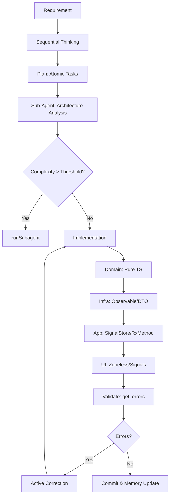
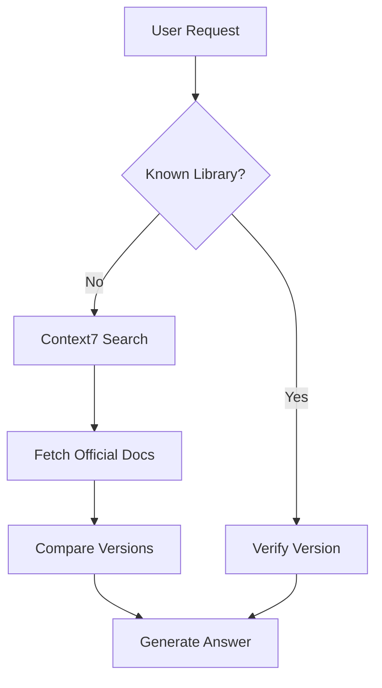
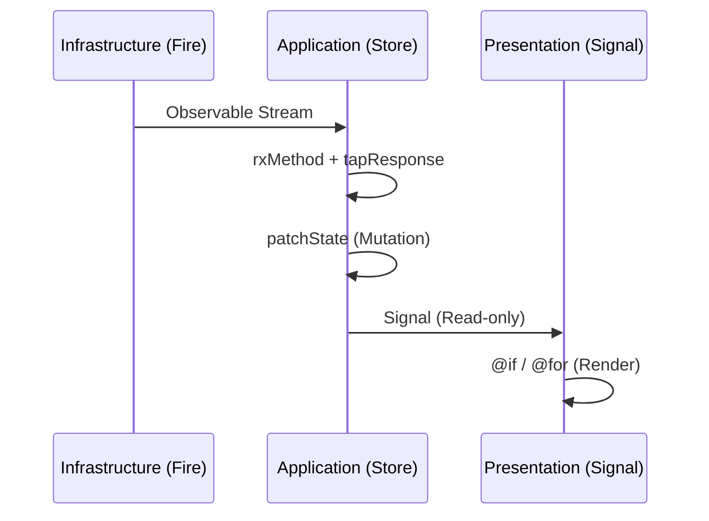

# Unified Agent Protocol: Angular 20+ DDD Pure Reactive

## 1. Prime Directives (Compliance is Mandatory)

**Core Philosophy:**
1.  **Strict DDD**: Layer boundaries are absolute. **Domain depends on NOTHING.**
2.  **Occam's Razor**: Simplest working solution. No speculative code.
3.  **Minimalism**: Zero boilerplate. Usage determines existence. Dead code = **DELETE**.
4.  **SRP**: One file, one purpose. One Store, one Feature.

## 2. Decision Logic & Workflows

### 2.1 Development Cycle (The "Strict" Flow)


### 2.2 External Library Resolution


### 2.3 Reactive Data Flow (Architecture)


## 3. Strict Project Structure (Standard DDD)

**Enforcement:** Files MUST reside in their semantic layers. **NO BARREL EXPORTS across layers.**

```text
src/app/
├── domain/ (PURE TS, NO FRAMEWORK IMPORTS)
│   ├── entities/           # Core Logic (No UI fields)
│   ├── value-objects/      # Immutable
│   ├── aggregates/         # Consistency Roots
│   ├── events/             # Domain Event Definitions
│   ├── repositories/       # Interfaces ONLY
│   ├── specifications/     # Business Rules
│   ├── factories/          # Creation Logic
│   └── types/              # Pure Domain Types
│
├── application/ (STATE & ORCHESTRATION)
│   ├── stores/             # signalStore (Source of Truth)
│   ├── commands/           # Use Cases
│   ├── queries/            # Read Models
│   ├── facades/            # UI -> App Boundary
│   ├── handlers/           # Command/Event Handlers
│   ├── validators/         # Application Validation
│   └── mappers/            # Domain <-> UI/DTO
│
├── infrastructure/ (IMPURE, FRAMEWORK DEPENDENT)
│   ├── persistence/        # Repo Implementations (@angular/fire)
│   ├── firebase/           # SDK Wrappers (Auth, Firestore)
│   ├── adapters/           # External APIs
│   ├── config/             # Env & Feature Flags
│   ├── event-bus/          # Event Dispatchers
│   └── dto/                # External Shapes
│
└── presentation/ (UI, SIGNAL CONSUMERS)
    ├── containers/         # Smart (Inject Facades/Stores)
    ├── components/         # Dumb (Inputs/Outputs ONLY)
    ├── pages/              # Route Entry
    ├── shell/              # App Shell
    ├── modules/            # Routing Modules
    ├── shared/             # Pure UI Shared
    ├── animations/         # Animation Definitions
    └── theme/              # Styles & Tokens
```

## 4. Boundary Enforcement Protocols

### 4.1 Layer Violations (Active Correction)
If `get_errors()` detects:
-   **TS2339 (UI -> Domain field missing)**:
    -   *Violation*: UI taking lazy shortcut.
    -   *Correction*: Create `ViewModel` in Application layer. Map Domain -> ViewModel.
-   **TS2345 (Store -> Repo type mismatch)**:
    -   *Violation*: Leaking Infra DTOs to Domain.
    -   *Correction*: Implement `Mapper` in Infrastructure. DTO -> Domain Entity.
-   **Dependency Import Violation**:
    -   *Rule*: `domain` imports `@angular/*` or `rxjs`.
    -   *Correction*: **DELETE** import. Abstract behavior to Interface (Domain) containing pure types only. Move implementation to Infrastructure.

### 4.2 Signal & State Governance
-   **Single Truth**: State exists ONLY in `signalStore`.
-   **No Redundant Streams**: Observable -> `rxMethod` -> State. No intermediate `BehaviorSubject`.
-   **Zoneless Law**: No `zone.js`. No `Promise` hacks. All updates via `signal`.
-   **Cross-Store Comms**: MUST use `EventBus`. Direct Store-to-Store dependence is **FORBIDDEN**.

## 5. Technology Stack (Approved vs Forbidden)

| Layer | Approved | Forbidden |
| :--- | :--- | :--- |
| **State** | `@ngrx/signals`, `signalStore`, `patchState` | `@ngrx/store`, `actions`, `reducers`, `effects` |
| **Async** | `rxMethod`, `tapResponse` | `async/await` in state, `.subscribe()` |
| **View** | `@if`, `@for`, `Signal<T>` | `*ngIf`, `*ngFor`, `zone.js` |
| **Data** | `@angular/fire` (Stream) | Raw SDK, Promise-based fetch |
| **Build** | `tsc --noEmit` | `any`, `// @ts-ignore` |

## 6. Execution Checklist

Before marking task complete, verify:

1.  [ ] **Compilation**: `pnpm build --strict` passes?
2.  [ ] **Architecture**: All files in correct DDD folders?
3.  [ ] **Purity**: Domain folder has ZERO imports from Angular/Firebase?
4.  [ ] **Reactive**: No manual subscriptions used?
5.  [ ] **Memory**: Update `Copilot Memory` with structural changes?

## 7. Global Checkpoints

*   **Cascading Updates**: Domain change -> Check `application/mappers`.
*   **Signal Hygiene**: Every `signal()` must be consumed. Dead signals -> **DELETE**.
*   **Single Source**: Identity/Workspace state lives in **ONE** store (`WorkspaceContextStore`).

---
**Generate ONLY code that complies with these Directives. Strictly enforce boundaries.**