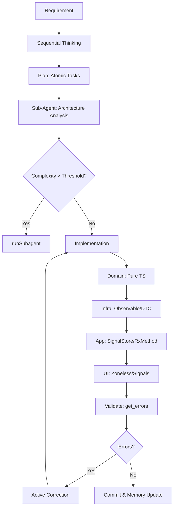
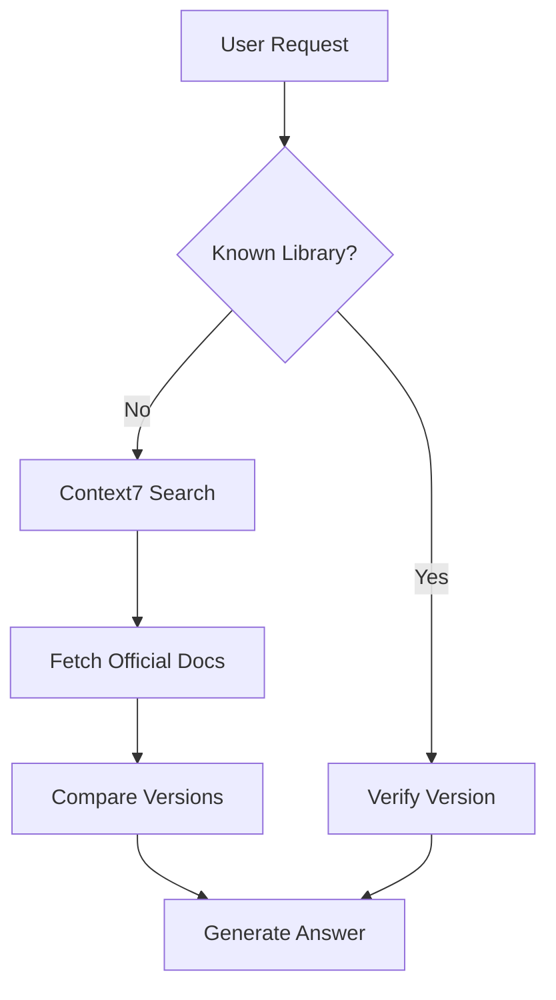
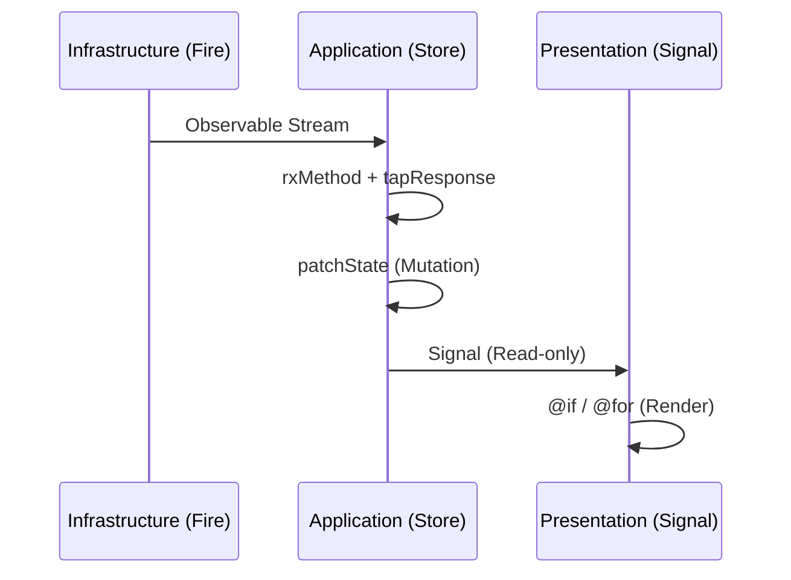

# Unified Agent Protocol: Angular 20+ DDD Pure Reactive

## 1. Prime Directives (Compliance is Mandatory)

**Core Philosophy:**
1.  **Strict DDD**: Layer boundaries are absolute. **Domain depends on NOTHING.**
2.  **Occam's Razor**: Simplest working solution. No speculative code.
3.  **Minimalism**: Zero boilerplate. Usage determines existence. Dead code = **DELETE**.
4.  **SRP**: One file, one purpose. One Store, one Feature.

## 2. Decision Logic & Workflows

### 2.1 Development Cycle (The "Strict" Flow)


### 2.2 External Library Resolution


### 2.3 Reactive Data Flow (Architecture)


## 3. Strict Project Structure (Standard DDD)

**Enforcement:** Files MUST reside in their semantic layers. **NO BARREL EXPORTS across layers.**

```text
src/app/
├── domain/ (PURE TS, NO FRAMEWORK IMPORTS)
│   ├── entities/           # Core Logic (No UI fields)
│   ├── value-objects/      # Immutable
│   ├── aggregates/         # Consistency Roots
│   ├── events/             # Domain Event Definitions
│   ├── repositories/       # Interfaces ONLY
│   ├── specifications/     # Business Rules
│   ├── factories/          # Creation Logic
│   └── types/              # Pure Domain Types
│
├── application/ (STATE & ORCHESTRATION)
│   ├── stores/             # signalStore (Source of Truth)
│   ├── commands/           # Use Cases
│   ├── queries/            # Read Models
│   ├── facades/            # UI -> App Boundary
│   ├── handlers/           # Command/Event Handlers
│   ├── validators/         # Application Validation
│   └── mappers/            # Domain <-> UI/DTO
│
├── infrastructure/ (IMPURE, FRAMEWORK DEPENDENT)
│   ├── persistence/        # Repo Implementations (@angular/fire)
│   ├── firebase/           # SDK Wrappers (Auth, Firestore)
│   ├── adapters/           # External APIs
│   ├── config/             # Env & Feature Flags
│   ├── event-bus/          # Event Dispatchers
│   └── dto/                # External Shapes
│
└── presentation/ (UI, SIGNAL CONSUMERS)
    ├── containers/         # Smart (Inject Facades/Stores)
    ├── components/         # Dumb (Inputs/Outputs ONLY)
    ├── pages/              # Route Entry
    ├── shell/              # App Shell
    ├── modules/            # Routing Modules
    ├── shared/             # Pure UI Shared
    ├── animations/         # Animation Definitions
    └── theme/              # Styles & Tokens
```

## 4. Boundary Enforcement Protocols

### 4.1 Layer Violations (Active Correction)
If `get_errors()` detects:
-   **TS2339 (UI -> Domain field missing)**:
    -   *Violation*: UI taking lazy shortcut.
    -   *Correction*: Create `ViewModel` in Application layer. Map Domain -> ViewModel.
-   **TS2345 (Store -> Repo type mismatch)**:
    -   *Violation*: Leaking Infra DTOs to Domain.
    -   *Correction*: Implement `Mapper` in Infrastructure. DTO -> Domain Entity.
-   **Dependency Import Violation**:
    -   *Rule*: `domain` imports `@angular/*` or `rxjs`.
    -   *Correction*: **DELETE** import. Abstract behavior to Interface (Domain) containing pure types only. Move implementation to Infrastructure.

### 4.2 Signal & State Governance
-   **Single Truth**: State exists ONLY in `signalStore`.
-   **No Redundant Streams**: Observable -> `rxMethod` -> State. No intermediate `BehaviorSubject`.
-   **Zoneless Law**: No `zone.js`. No `Promise` hacks. All updates via `signal`.
-   **Cross-Store Comms**: MUST use `EventBus`. Direct Store-to-Store dependence is **FORBIDDEN**.

## 5. Technology Stack (Approved vs Forbidden)

| Layer | Approved | Forbidden |
| :--- | :--- | :--- |
| **State** | `@ngrx/signals`, `signalStore`, `patchState` | `@ngrx/store`, `actions`, `reducers`, `effects` |
| **Async** | `rxMethod`, `tapResponse` | `async/await` in state, `.subscribe()` |
| **View** | `@if`, `@for`, `Signal<T>` | `*ngIf`, `*ngFor`, `zone.js` |
| **Data** | `@angular/fire` (Stream) | Raw SDK, Promise-based fetch |
| **Build** | `tsc --noEmit` | `any`, `// @ts-ignore` |

## 6. Execution Checklist

Before marking task complete, verify:

1.  [ ] **Compilation**: `pnpm build --strict` passes?
2.  [ ] **Architecture**: All files in correct DDD folders?
3.  [ ] **Purity**: Domain folder has ZERO imports from Angular/Firebase?
4.  [ ] **Reactive**: No manual subscriptions used?
5.  [ ] **Memory**: Update `Copilot Memory` with structural changes?

## 7. Global Checkpoints

*   **Cascading Updates**: Domain change -> Check `application/mappers`.
*   **Signal Hygiene**: Every `signal()` must be consumed. Dead signals -> **DELETE**.
*   **Single Source**: Identity/Workspace state lives in **ONE** store (`WorkspaceContextStore`).

---

## 8. Detailed Compliance Rules (Strict Enforcement)

**一、編譯與執行層級硬性條件**

1.  TypeScript 編譯必須完全乾淨，`tsc --noEmit` 不得出現任何錯誤。
2.  Angular AOT production build 必須成功，且使用 `ng build --configuration production`。
3.  專案必須完全採用 Zone-less 架構。
4.  專案中不得引入 `zone.js`。
5.  專案不得依賴任何 Zone-based 行為。
6.  不得使用任何僅為通過 build 而存在的 runtime-only hack。

**二、狀態模型（Single State Authority）**

7.  Angular Signals 是唯一合法的狀態來源。
8.  不得使用 `Subject` 作為狀態。
9.  不得使用 `BehaviorSubject` 作為狀態。
10. 不得使用 `ReplaySubject` 作為狀態。
11. 不得使用 NgRx Store 或 ComponentStore 作為狀態。
12. 不得將任何 Observable 視為狀態本身。
13. Observable 只能用於 I/O 行為。
14. Observable 只能用於外部事件來源。
15. Observable 只能用於非持久性的資料流。
16. 若 Observable 消失後狀態仍應存在，則該設計必定違規。
17. 若 Observable 僅用於取得資料並立即寫入 signal，則屬合法用法。

**三、Signals 使用邊界**

18. 只有 Application 層可以持有 writable signal。
19. 只有 Application 層可以定義 effect。
20. Presentation 層只能讀取 signal，不得修改。
21. Presentation 層不得建立跨生命週期的 writable signal。
22. Presentation 層不得持有任何業務狀態的真相。
23. Domain 層完全禁止使用 signal。
24. Infrastructure 層完全禁止使用 signal。
25. 所有狀態變化必須透過 `signal.set` 或 `signal.update` 明確發生。
26. 不得依賴任何隱式的變更偵測機制。

**四、DDD 分層與依賴方向**

27. 依賴方向只能是 domain → application → infrastructure → presentation。
28. Domain 層必須是純 TypeScript。
29. Domain 層不得依賴 Angular。
30. Domain 層不得依賴 RxJS。
31. Domain 層不得使用 async 行為。
32. Domain 層只能包含 Entity、ValueObject、Domain Service 與 Interface。
33. Application 層負責業務流程與狀態協調。
34. Application 層是唯一狀態真相的持有者。
35. Application 層不得 import infrastructure 的實作。
36. Infrastructure 層只能實作 application 或 domain 定義的 interface。
37. Infrastructure 層負責封裝 `@angular/fire`、HTTP 與 Storage。
38. Infrastructure 層不得向外暴露 framework 型別。
39. Presentation 層只負責 UI 與互動。
40. Presentation 層只能依賴 application facade。
41. Presentation 層不得包含任何業務邏輯。
42. 任何反向依賴一律視為架構錯誤並必須修正。

**五、Observable 使用規則**

43. Observable 只能作為 I/O 管道使用。
44. HTTP Observable 只能在 subscribe 後將結果寫入 signal。
45. Firebase 或串流型 Observable 只能在轉換後更新 signal。
46. 不得使用 `shareReplay` 作為快取機制。
47. 不得使用 Observable 作為跨 component 的狀態。
48. 不得使用 RxJS pipeline 作為狀態機。
49. Observable 不得成為任何層級的事實來源。

**六、Zone-less 行為約束**

50. 所有 UI 更新只能由 signal 觸發。
51. 不得依賴 Promise resolve 自動觸發畫面更新。
52. 不得依賴 setTimeout 或 microtask 造成的隱式 render。
53. 所有非同步結果都必須明確寫回 signal。

**七、Angular AOT 安全規則**

54. 所有 decorator metadata 必須是靜態可分析的。
55. 不得使用動態 provider。
56. 不得在 runtime 決定 component 或 service。
57. 不得使用 any-based DI。
58. 所有 DI 必須使用明確型別或 `InjectionToken<T>`。
59. constructor 中不得啟動任何業務流程。
60. constructor 只能用於注入與同步初始化。

**八、Guard / Resolver 規則**

61. Guard 只能做純條件判斷。
62. Guard 不得產生任何副作用。
63. Guard 只能回傳 `boolean` 或 `UrlTree`。
64. Resolver 不得作為狀態來源。
65. Resolver 不得隱式啟動任何流程。

**九、Shared 使用規則**

66. shared 不得成為狀態真相。
67. shared 不得包含任何業務決策。
68. 若 shared service 被多個 feature 當作核心邏輯使用，必須上移至 application。
69. 若無法上移，則必須降級為完全無狀態的 UI utility。

**十、結構一致性要求**

70. 檔案的實體位置必須準確反映其語意與分層。
71. 不得出現名稱屬於 domain 但實際為 UI 的檔案。
72. 不得將 application 職責的功能放入 shared。
73. Barrel export 不得造成任何隱性的反向依賴。

**十一、最終驗收條件**

74. Domain 必須能完全獨立編譯與測試。
75. Application 不得依賴 UI 或 Angular。
76. Presentation 只能依賴 application。
77. 專案中不得存在任何循環依賴。
78. 專案中不得殘留任何 RxJS 狀態。
79. Angular AOT production build 必須成功。

---
**Generate ONLY code that complies with these Directives. Strictly enforce boundaries.**