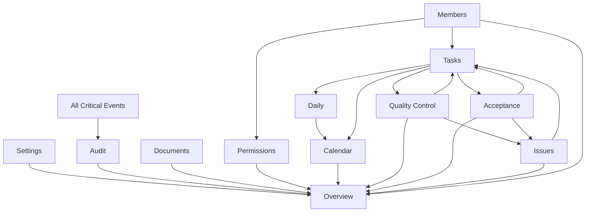

# Black-Tortoise 12-Module Implementation Order & Multi-Phase Execution Plan

**Document Version:** 1.0  
**Created:** 2025-01-27  
**Status:** Canonical Reference for Module Implementation  
**Principles:** Strict DDD, SRP, High Cohesion, Low Coupling, Pure Reactive (Zone-less)

---

## Executive Summary

This document defines the **strict implementation order** for Black-Tortoise's 12 workspace modules, respecting Domain-Driven Design (DDD) layer boundaries, dependency graphs, and event-driven architecture. The order ensures:

1. **Zero Circular Dependencies**: Modules are built in topological order
2. **Layer Purity**: Domain entities precede Application stores, which precede Infrastructure, which precede Presentation
3. **Event Flow Integrity**: Event publishers are implemented before subscribers
4. **Incremental Validation**: Each phase is independently compilable and testable

---

## Current State Assessment

### ✅ Already Implemented (Foundation)
- **Event Infrastructure**: `ModuleEventBus`, `EventHandlerRegistry`, `PublishEventHandler`
- **Workspace Runtime**: `WorkspaceStore`, `WorkspaceRuntimeFactory`, context management
- **Application Stores**: All 12 module stores exist as **skeletons** (needs enrichment):
  - `permissions.store.ts`, `documents.store.ts`, `tasks.store.ts`, `daily.store.ts`
  - `quality-control.store.ts`, `acceptance.store.ts`, `issues.store.ts`, `overview.store.ts`
  - `members.store.ts`, `audit.store.ts`, `settings.store.ts`
- **Auth & Identity**: `auth.store.ts`, `identity-context.store.ts`, `organization.store.ts`

### ❌ Missing (To Be Implemented)
- **Domain Entities**: Only 3 core entities exist (`Organization`, `User`, `Workspace`)
  - Missing: `Task`, `Role`, `Permission`, `Member`, `FileNode`, `DailyEntry`, `QCItem`, `AcceptanceItem`, `Issue`, `AuditEntry`, `WorkspaceSettings`, etc.
- **Value Objects**: Missing `Money`, `TaskStatus`, domain-specific VOs
- **Repository Interfaces**: Domain layer repository contracts
- **Infrastructure Repositories**: Firestore implementations for all modules
- **Presentation Components**: Module-specific UI components, dialogs, forms
- **Calendar Store**: Not yet created (needs to aggregate Tasks + Daily)

---

## Dependency Graph Analysis

### Module Dependencies (Event Flow)

### Dependency Levels (Bottom-Up)

**Level 0 (Foundation - No Dependencies)**
- Settings
- Audit (infrastructure only, subscribes to all)
- Documents

**Level 1 (RBAC Foundation)**
- Members (publishes `MemberRoleChanged`)
- Permissions (subscribes to `MemberRoleChanged`)

**Level 2 (Core Entity)**
- Issues (entity must exist before QC/Acceptance can create issues)

**Level 3 (Business Core)**
- Tasks (depends on Members for assignment, Issues for blocking)

**Level 4 (Task Workflow Consumers)**
- Daily (subscribes to `TaskProgressUpdated`)
- Quality Control (subscribes to `TaskReadyForQC`, publishes `QCPassed/Failed`)
- Acceptance (subscribes to `TaskReadyForAcceptance`, publishes `AcceptanceApproved/Rejected`)

**Level 5 (Aggregator - Time View)**
- Calendar (computed from Tasks + Daily stores)

**Level 6 (Aggregator - Dashboard)**
- Overview (subscribes to all module events)

---

## Strict Implementation Order (12 Modules)

### Phase 1: Autonomous Modules (No Cross-Module Dependencies)
**Duration Estimate:** 3-4 days  
**Validation:** Modules operate independently, zero event subscriptions

#### 1.1 Settings Module
- **Rationale**: Configuration foundation; no external dependencies
- **Artifacts**:
  - Domain: `WorkspaceSettings` entity, `SettingsRepository` interface
  - Infrastructure: `SettingsFirestoreRepository`, DTOs
  - Application: Enrich `settings.store.ts` (state, methods)
  - Presentation: Settings panels (General, Modules, Notifications)
- **Events**: Publishes `SettingsChanged`, `ModuleToggled`
- **Acceptance Criteria**: Can update workspace name, toggle modules, save preferences

#### 1.2 Audit Module
- **Rationale**: Cross-cutting concern, append-only, consumes all events (passive listener)
- **Artifacts**:
  - Domain: `AuditEntry` entity, `AuditRepository` interface
  - Infrastructure: `AuditFirestoreRepository` (append-only writes)
  - Application: Enrich `audit.store.ts` (read-only state, log query methods)
  - Presentation: Audit log table, filters, JSON diff viewer
- **Events**: Subscribes to **ALL** critical domain events (implement handlers last)
- **Special Note**: Infrastructure layer can be done early; event handlers added in Phase 6
- **Acceptance Criteria**: Can display audit logs, filter by actor/module/date

#### 1.3 Documents Module
- **Rationale**: File management, no business logic dependencies
- **Artifacts**:
  - Domain: `FileNode` entity (tree structure), `DocumentsRepository` interface
  - Infrastructure: `DocumentsFirestoreRepository`, `StorageAdapter` (Firebase Storage)
  - Application: Enrich `documents.store.ts` (file tree state, upload queue)
  - Presentation: File tree (mat-tree + CDK Drag&Drop), upload dialog, preview
- **Events**: Publishes `FolderCreated`, `DocumentUploaded`, `DocumentDeleted`
- **Acceptance Criteria**: Can upload files, organize folders, preview images/PDFs

---

### Phase 2: RBAC Foundation (Member & Permission Management)
**Duration Estimate:** 3-4 days  
**Dependencies:** None (Level 1)  
**Validation:** Role assignment, permission matrix functional

#### 2.1 Members Module
- **Rationale**: User roster must exist before Tasks (assignment) and Permissions (role changes)
- **Artifacts**:
  - Domain: `Member` entity, `Invitation` entity, `MembersRepository` interface
  - Infrastructure: `MembersFirestoreRepository`
  - Application: Enrich `members.store.ts` (members map, invitations, role assignment)
  - Presentation: Member list table, invite dialog, profile cards
- **Events**: 
  - Publishes: `MemberInvited`, `MemberAdded`, `MemberRemoved`, `MemberRoleChanged`
- **Acceptance Criteria**: Can invite members, assign roles, remove members

#### 2.2 Permissions Module
- **Rationale**: RBAC system, depends on Members for role change events
- **Artifacts**:
  - Domain: `Role` entity, `Permission` entity, `PermissionMatrix` type
  - Infrastructure: `PermissionsFirestoreRepository`
  - Application: Enrich `permissions.store.ts` (roles, matrix, computed permissions)
  - Presentation: Permission matrix (MatTable), role CRUD dialogs, role color picker
- **Events**: 
  - Publishes: `RoleCreated`, `RoleUpdated`, `PermissionGranted`, `PermissionRevoked`
  - Subscribes: `MemberRoleChanged` → Update permission cache
- **Acceptance Criteria**: Can create roles, assign permissions, real-time permission checks

---

### Phase 3: Core Entity - Issues (Standalone Entity)
**Duration Estimate:** 2-3 days  
**Dependencies:** None (Level 2 - but needed by QC/Acceptance)  
**Validation:** Issue CRUD works independently

#### 3.1 Issues Module
- **Rationale**: Issues entity must exist BEFORE QC/Acceptance (they create issues on failure)
- **Artifacts**:
  - Domain: `Issue` entity (type, priority, status, relatedTaskId)
  - Infrastructure: `IssuesFirestoreRepository`
  - Application: Enrich `issues.store.ts` (issues map, blocking logic)
  - Presentation: Issue list/board, issue detail (activity history), create dialog
- **Events**: 
  - Publishes: `IssueCreated`, `IssueResolved`, `IssueClosed`
  - Subscribes: `QCFailed`, `AcceptanceRejected` (handlers added in Phase 4)
- **Acceptance Criteria**: Can create/resolve/close issues, view issue details

---

### Phase 4: Business Core - Tasks (Central Workflow Hub)
**Duration Estimate:** 5-6 days (complex)  
**Dependencies:** Members (for assignment), Issues (for blocking)  
**Validation:** Task CRUD, hierarchy, status transitions, multi-view rendering

#### 4.1 Tasks Module
- **Rationale**: Central business entity; all workflow modules depend on this
- **Artifacts**:
  - Domain: 
    - `Task` entity (hierarchy, unitPrice, quantity, progress, status, assignees)
    - `Money` value object, `TaskStatus` value object
    - `TasksRepository` interface
  - Infrastructure: `TasksFirestoreRepository`, DTOs with nested children handling
  - Application: Enrich `tasks.store.ts` (task map, computed total price/progress, hierarchy logic)
  - Presentation: 
    - Task list (virtual scroll), Task Gantt (CSS Grid), Task Kanban (CDK Drag&Drop)
    - Task detail form (unit price/quantity calculator)
    - Zero-refetch view switching (List ↔ Gantt ↔ Kanban)
- **Events**: 
  - Publishes: `TaskCreated`, `TaskUpdated`, `TaskAssigneeChanged`, `TaskProgressUpdated`, `TaskReadyForQC`, `TaskReadyForAcceptance`
  - Subscribes: `QCPassed/Failed`, `AcceptanceApproved/Rejected`, `IssueResolved` (unblock)
- **Complex Logic**:
  - Infinite sub-task hierarchy (recursive aggregation)
  - Parent progress = weighted average of children
  - Parent totalPrice = sum of children
  - Status workflow: Draft → QC → Acceptance → Done
- **Acceptance Criteria**: Can create nested tasks, calculate prices, switch views, track progress

---

### Phase 5: Task Workflow Consumers (Daily, QC, Acceptance)
**Duration Estimate:** 6-7 days (3 modules in parallel or sequence)  
**Dependencies:** Tasks (Level 4), Issues (for QC/Acceptance failures)  
**Validation:** Complete workflow: Task → Daily logging → QC review → Acceptance sign-off

#### 5.1 Daily Module
- **Rationale**: Worklog/timesheet, auto-logs task interactions
- **Artifacts**:
  - Domain: `DailyEntry` entity (taskId, manDays, completedQuantity)
  - Infrastructure: `DailyFirestoreRepository`
  - Application: Enrich `daily.store.ts` (entries map, computed stats)
  - Presentation: Quick entry form, weekly calendar grid, man-day validation warnings
- **Events**: 
  - Publishes: `DailyEntryCreated`, `DailyEntryUpdated`
  - Subscribes: `TaskProgressUpdated` → Trigger auto-log (debounced)
- **Validation Logic**: Warn if man-days > 1.0 per day
- **Acceptance Criteria**: Can log work, view weekly stats, auto-log from task updates

#### 5.2 Quality Control Module
- **Rationale**: Task output verification, gatekeeper before Acceptance
- **Artifacts**:
  - Domain: `QCItem` entity (checklist, inspectorId, status, taskSnapshot)
  - Infrastructure: `QCFirestoreRepository`
  - Application: Enrich `quality-control.store.ts` (QC items, pass/fail logic)
  - Presentation: QC inspector view (split screen: task snapshot vs checklist), reject reason dialog
- **Events**: 
  - Publishes: `QCPassed` (updates Task), `QCFailed` (updates Task + creates Issue)
  - Subscribes: `TaskReadyForQC` → Create QCItem
- **Business Rules**: 
  - Pass = All required checklist items checked
  - Fail = Must provide reason (auto-creates Issue)
- **Acceptance Criteria**: Can review tasks, mark pass/fail, auto-create issues on failure

#### 5.3 Acceptance Module
- **Rationale**: Business/commercial acceptance, final gate before task completion
- **Artifacts**:
  - Domain: `AcceptanceItem` entity (criteria, validatorId, status, docs)
  - Infrastructure: `AcceptanceFirestoreRepository`
  - Application: Enrich `acceptance.store.ts` (acceptance items, approval logic)
  - Presentation: Review UI (deliverables vs criteria), approve/reject buttons, mandatory rejection reason
- **Events**: 
  - Publishes: `AcceptanceApproved` (Task completed), `AcceptanceRejected` (Task blocked + Issue created)
  - Subscribes: `TaskReadyForAcceptance` (from Task or QC)
- **Business Rules**: Rejection requires mandatory reason input
- **Acceptance Criteria**: Can approve/reject deliverables, auto-create issues on rejection

---

### Phase 6: Aggregator - Calendar (Time-Centric View)
**Duration Estimate:** 3-4 days  
**Dependencies:** Tasks (deadlines), Daily (worklogs)  
**Validation:** Calendar displays tasks and logs, drag-to-reschedule works

#### 6.1 Calendar Module
- **Rationale**: Time-centric aggregation, no new domain entities (view-only)
- **Artifacts**:
  - Domain: `CalendarEvent` view model (derived from Task + DailyEntry)
  - Application: **CREATE** `calendar.store.ts` (viewDate, viewMode, computed events)
  - Presentation: Month grid, week time-grid, event chips (colored by type), filters
- **Special Logic**: 
  - Zero-Refetch: Events computed from `tasksStore.entities()` + `dailyStore.entries()`
  - Drag event → Calls `TasksService.updateDueDate()`
- **Events**: No publications; purely reactive via `computed()` signals
- **Acceptance Criteria**: Can view tasks/logs in calendar, filter by assignee, drag to reschedule

---

### Phase 7: Aggregator - Overview (Dashboard)
**Duration Estimate:** 3-4 days  
**Dependencies:** All modules (subscribes to all events)  
**Validation:** Dashboard displays KPIs, activity timeline, customizable widgets

#### 7.1 Overview Module
- **Rationale**: Workspace dashboard, final aggregator
- **Artifacts**:
  - Domain: `DashboardMetric` view model, `ActivityLog` view model, `WidgetConfig`
  - Application: Enrich `overview.store.ts` (metrics map, activities, layout config)
  - Presentation: 
    - Responsive grid layout (CSS Grid/Masonry)
    - Widgets: Task progress, issue status, recent files, team load
    - Drag & Drop widget ordering
    - Activity timeline
- **Events**: 
  - Subscribes: Global listeners for `TaskCompleted`, `IssueCreated`, `DocumentUploaded`, etc.
  - Updates counters optimistically or fetches aggregated metrics
- **Acceptance Criteria**: Can view KPIs, customize dashboard layout, see recent activity

---

## Per-Module Layer Implementation Order (Strict DDD)

For **each module** in the phases above, implement in this exact sequence:

### Step 1: Domain Layer (Pure TypeScript)
**Files to Create/Update:**
- `src/app/domain/entities/{entity-name}.entity.ts`
- `src/app/domain/value-objects/{vo-name}.vo.ts` (if needed)
- `src/app/domain/repositories/{module-name}.repository.ts` (interface only)
- `src/app/domain/events/{event-name}.event.ts` (event classes)

**Constraints:**
- ❌ NO imports from `@angular/*`, `rxjs`, `firebase`
- ✅ Pure business logic only
- ✅ Validation in entity constructors
- ✅ Computed properties via getters

**Validation:** `tsc --noEmit` passes, zero framework dependencies

---

### Step 2: Infrastructure Layer (External Integrations)
**Files to Create/Update:**
- `src/app/infrastructure/repositories/{module-name}.firestore.repository.ts`
- `src/app/infrastructure/dto/{module-name}.dto.ts` (wire formats)
- `src/app/infrastructure/adapters/{adapter-name}.adapter.ts` (if needed)

**Constraints:**
- ✅ Implements Domain repository interfaces
- ✅ Maps DTOs ↔ Domain entities
- ✅ Handles Firebase SDK calls
- ❌ NO business logic

**Validation:** Integration tests with mocked Firestore, DTOs serialize correctly

---

### Step 3: Application Layer (State & Orchestration)
**Files to Create/Update:**
- `src/app/application/stores/{module-name}.store.ts` (enrich existing skeletons)
- `src/app/application/services/{module-name}.service.ts` (if complex orchestration needed)
- `src/app/application/mappers/{module-name}.mapper.ts` (DTO → Entity transformations)
- `src/app/application/handlers/{module-name}.event-handlers.ts` (event subscriptions)

**Constraints:**
- ✅ Single Source of Truth: `signalStore` only
- ✅ Async via `rxMethod` + `tapResponse`
- ✅ State updates via `patchState`
- ✅ Computed signals for derived state
- ❌ NO `BehaviorSubject`, NO manual observables in state

**Event Integration:**
- Register event handlers in `EventHandlerRegistry`
- Publish events via `publishEvent` utility
- Subscribe to events via `ModuleEventBus`

**Validation:** Store tests (state transitions, computed signals), event flow tests

---

### Step 4: Presentation Layer (UI Components)
**Files to Create/Update:**
- `src/app/presentation/pages/{module-name}-page.component.ts` (route entry)
- `src/app/presentation/components/{feature}/` (feature components)
- `src/app/presentation/layouts/{layout}/` (if reusable visual widgets)
- Routing configuration

**Constraints:**
- ✅ Logic-less templates: `@if`, `@for` only
- ✅ Read signals via `signal()` in templates
- ✅ Call store methods for actions
- ❌ NO business logic in components
- ❌ NO direct service calls (only via stores)
- ✅ ComponentHarness for testing

**Material 3 Design:**
- Use Material Design 3 tokens
- Responsive layouts (Grid, Flexbox)
- Accessibility (ARIA labels, keyboard navigation)

**Validation:** Component tests (rendering, user interactions), accessibility checks

---

## Multi-Phase Execution Strategy

### Phase Cadence (Iterative)
Each phase follows this rhythm:
1. **Domain First** (All modules in phase): 1 day
2. **Infrastructure** (All modules in phase): 1-2 days
3. **Application** (All modules in phase): 2-3 days
4. **Presentation** (All modules in phase): 2-3 days
5. **Integration Testing**: 1 day
6. **Validation Checkpoint**: Compile, test, manual verification

### Validation Checkpoints
After each phase:
- ✅ `pnpm build --strict` → 0 errors
- ✅ `pnpm test` → All tests pass
- ✅ Manual smoke test of implemented features
- ✅ Event flow verification (via Audit logs)
- ✅ Update this document with ✅/❌ status

### Parallelization Opportunities
**Phase 1**: Settings, Audit, Documents can be developed in parallel (3 devs)  
**Phase 2**: Members → Permissions (sequential, but Members can have 1 dev, Permissions another)  
**Phase 5**: Daily, QC, Acceptance can be parallelized (3 devs) after Tasks is complete

---

## Cross-Cutting Concerns (Pre-Implementation)

### 1. EventBus Registration (Application Layer)
Before implementing stores, ensure:
- `ModuleEventBus` is injected at workspace scope
- Event handlers registered in `EventHandlerRegistry`
- Events follow three-phase pattern: `Append → Publish → React`

### 2. Workspace Context Initialization
All module stores must:
- Accept `workspaceId` during initialization
- Subscribe to `WorkspaceContextChanged` event
- Destroy state on workspace switch

### 3. Error Handling Strategy
- **Local Errors**: `rxMethod` uses `tapResponse(error: ...)`
- **State Reflection**: `patchState({ error, loading: false })`
- **Global Errors**: `HttpInterceptor` for 401/403
- **UI Feedback**: Components react to `store.error()` signal

### 4. Testing Strategy
- **Domain**: Pure unit tests (Jest/Vitest), 100% logic coverage
- **Infrastructure**: Integration tests with mocked SDKs
- **Application**: State tests (TestBed light), key flows
- **Presentation**: ComponentHarness, happy path + edge cases

---

## Definition of Done (Per Module)

Before marking a module as complete:
- [ ] **Compilation**: `pnpm build --strict` passes (0 errors)
- [ ] **Architecture**: Files in correct DDD folders
- [ ] **Domain Purity**: Domain layer has zero framework imports
- [ ] **Reactivity**: All async flows via `rxMethod` + Signals
- [ ] **Tests**: Domain (unit), Infrastructure (integration), App (state), Presentation (component)
- [ ] **Events**: Event handlers registered and tested
- [ ] **UI**: Components render correctly, accessibility checks pass
- [ ] **Documentation**: Update module status in this document
- [ ] **Memory**: Record any architectural decisions in Copilot Memory

---

## Implementation Status Tracker

| Module | Phase | Domain | Infra | App Store | Presentation | Status |
|--------|-------|--------|-------|-----------|--------------|--------|
| **Settings** | 1 | ⬜ | ⬜ | 🟨 (skeleton) | ⬜ | Not Started |
| **Audit** | 1 | ⬜ | ⬜ | 🟨 (skeleton) | ⬜ | Not Started |
| **Documents** | 1 | ⬜ | ⬜ | 🟨 (skeleton) | ⬜ | Not Started |
| **Members** | 2 | ⬜ | ⬜ | 🟨 (skeleton) | ⬜ | Not Started |
| **Permissions** | 2 | ⬜ | ⬜ | 🟨 (skeleton) | ⬜ | Not Started |
| **Issues** | 3 | ⬜ | ⬜ | 🟨 (skeleton) | ⬜ | Not Started |
| **Tasks** | 4 | ⬜ | ⬜ | 🟨 (skeleton) | ⬜ | Not Started |
| **Daily** | 5 | ⬜ | ⬜ | 🟨 (skeleton) | ⬜ | Not Started |
| **Quality Control** | 5 | ⬜ | ⬜ | 🟨 (skeleton) | ⬜ | Not Started |
| **Acceptance** | 5 | ⬜ | ⬜ | 🟨 (skeleton) | ⬜ | Not Started |
| **Calendar** | 6 | ⬜ | N/A | ⬜ (not created) | ⬜ | Not Started |
| **Overview** | 7 | ⬜ | N/A | 🟨 (skeleton) | ⬜ | Not Started |

**Legend:**
- ⬜ Not Started
- 🟨 Partial (skeleton exists)
- 🟩 Complete
- ✅ Tested & Validated

---

## Risk Mitigation

### Risk 1: Circular Dependencies in Event Subscriptions
- **Mitigation**: Strict topological ordering; event handlers are passive (no recursive publishing)
- **Detection**: Static analysis with `madge --circular`

### Risk 2: Store State Bloat
- **Mitigation**: Use EntityMap patterns; implement pagination/virtualization early
- **Detection**: Bundle size analysis, runtime memory profiling

### Risk 3: Type Safety Loss in Event Payloads
- **Mitigation**: Strongly-typed event classes; use discriminated unions
- **Detection**: `tsc --strict` enforcement

### Risk 4: UI Performance Degradation (Large Datasets)
- **Mitigation**: Virtual scrolling (CDK), lazy loading, computed memoization
- **Detection**: Lighthouse audits, FCP/TTI metrics

---

## Success Criteria (Project-Wide)

### Technical Excellence
- ✅ Zero `any` types in production code
- ✅ Zero layer violations (checked via ESLint custom rules)
- ✅ 100% compilation in strict mode
- ✅ All stores use `signalStore` (no legacy `@ngrx/store`)

### Functional Completeness
- ✅ All 12 modules operational
- ✅ Complete task workflow: Create → Assign → Daily Log → QC → Acceptance → Done
- ✅ Event-driven cross-module communication working
- ✅ Audit trail captures all critical operations

### User Experience
- ✅ Sub-200ms UI response times (optimistic updates)
- ✅ Zero full-page reloads during navigation
- ✅ Accessible (WCAG 2.1 AA compliance)
- ✅ Responsive design (mobile, tablet, desktop)

---

## Appendix: Key Architectural Decisions

### ADR-001: Shared Domain Folders vs. Per-Module Folders
**Decision**: Use shared `domain/entities/`, `domain/repositories/` folders instead of `domain/tasks/`, `domain/permissions/`, etc.  
**Rationale**: Enforces a unified bounded context; prevents module silos; easier refactoring  
**Trade-off**: Slightly harder to identify module ownership by folder structure alone

### ADR-002: Calendar as View-Only Aggregator
**Decision**: Calendar does not own data; it computes events from Tasks and Daily stores  
**Rationale**: Zero redundancy; single source of truth; automatic consistency  
**Trade-off**: Cannot implement calendar-only features (e.g., standalone events)

### ADR-003: Issues Entity Before QC/Acceptance
**Decision**: Implement Issues (Phase 3) before QC/Acceptance (Phase 5)  
**Rationale**: QC/Acceptance must be able to create Issues on failure; entity must exist first  
**Trade-off**: Issue resolution flow (IssueResolved → Task unblock) creates a runtime cycle, but this is acceptable for events

### ADR-004: Audit Subscribes to All, Publishes Nothing
**Decision**: Audit module is a passive observer; it never publishes events  
**Rationale**: Prevents infinite audit loops; maintains append-only semantics  
**Trade-off**: Cannot react to audit trail being queried (acceptable limitation)

---

## Document Maintenance

### Update Triggers
- Change module implementation order → Update dependency graph
- Add new module → Insert into correct phase, update dependency analysis
- Change layer structure → Update per-module implementation order
- Complete module implementation → Update status tracker

### Versioning
- **1.0**: Initial plan (2025-01-27)
- **1.x**: Update after each phase completion (mark status tracker)
- **2.0**: Major revision if architecture changes

---

**End of Implementation Order Specification**  
*Follow this plan strictly. Deviations require documented justification.*
