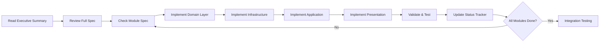

# Black-Tortoise Module Implementation - Documentation Index

**Last Updated:** 2025-01-27  
**Status:** Planning Complete ✅

---

## Quick Links

| Document | Purpose | Size | Audience |
|----------|---------|------|----------|
| [Executive Summary](./IMPLEMENTATION_ORDER_SUMMARY.md) | High-level overview, decisions, timeline | 12KB | PM, Tech Lead |
| [Full Implementation Order](./IMPLEMENTATION_ORDER.md) | Canonical specification, detailed rationale | 24KB | Developers, Architects |
| [Visual Phase Guide](./MODULE_IMPLEMENTATION_PHASES.md) | Diagrams, Gantt charts, quick reference | 13KB | Developers, Team |
| [Module Specs (English)](./modular/) | Individual module specifications (12 files) | - | Developers |
| [Module Specs (Chinese)](./modulars/) | 中文模組規格 (12 files) | - | Chinese Readers |
| [Architecture Constitution](./workspace-modular-architecture.constitution.md) | DDD principles, layer rules | - | All Team |

---

## 12 Modules Overview

### Autonomous Modules (Phase 1)
1. **[Settings](./modular/12-settings-module.md)** - Workspace configuration, module toggles
2. **[Audit](./modular/10-audit-module.md)** - Operation logging, compliance trail
3. **[Documents](./modular/02-documents-module.md)** - File/folder management, uploads

### RBAC Foundation (Phase 2)
4. **[Members](./modular/09-members-module.md)** - User roster, invitations, role assignment
5. **[Permissions](./modular/01-permissions-module.md)** - RBAC matrix, permission checks

### Core Entity (Phase 3)
6. **[Issues](./modular/07-issues-module.md)** - Defect tracking, blocking states

### Business Core (Phase 4)
7. **[Tasks](./modular/03-tasks-module.md)** - Project management, hierarchy, workflow

### Workflow Consumers (Phase 5)
8. **[Daily](./modular/04-daily-module.md)** - Worklog, timesheet, man-day tracking
9. **[Quality Control](./modular/05-quality-control-module.md)** - Task verification, checklist
10. **[Acceptance](./modular/06-acceptance-module.md)** - Business acceptance, sign-off

### Aggregators (Phase 6-7)
11. **[Calendar](./modular/11-calendar-module.md)** - Time-centric view (Tasks + Daily)
12. **[Overview](./modular/08-overview-module.md)** - Dashboard, KPIs, activity timeline

---

## Implementation Workflow



---

## Phase Timeline (Visual)

```
Phase 1 (3-4d)  │ Settings, Audit, Documents (parallel)
Phase 2 (3-4d)  │ Members → Permissions (sequential)
Phase 3 (2-3d)  │ Issues
Phase 4 (5-6d)  │ Tasks (all devs)
Phase 5 (6-7d)  │ Daily, QC, Acceptance (parallel)
Phase 6 (3-4d)  │ Calendar
Phase 7 (3-4d)  │ Overview
                │
Total: 26-28 days (3 devs, parallelized)
```

---

## Current Implementation Status

| Module | Domain | Infra | App Store | Presentation | Status |
|--------|--------|-------|-----------|--------------|--------|
| Settings | ⬜ | ⬜ | 🟨 | ⬜ | Not Started |
| Audit | ⬜ | ⬜ | 🟨 | ⬜ | Not Started |
| Documents | ⬜ | ⬜ | 🟨 | ⬜ | Not Started |
| Members | ⬜ | ⬜ | 🟨 | ⬜ | Not Started |
| Permissions | ⬜ | ⬜ | 🟨 | ⬜ | Not Started |
| Issues | ⬜ | ⬜ | 🟨 | ⬜ | Not Started |
| Tasks | ⬜ | ⬜ | 🟨 | ⬜ | Not Started |
| Daily | ⬜ | ⬜ | 🟨 | ⬜ | Not Started |
| QC | ⬜ | ⬜ | 🟨 | ⬜ | Not Started |
| Acceptance | ⬜ | ⬜ | 🟨 | ⬜ | Not Started |
| Calendar | ⬜ | N/A | ⬜ | ⬜ | Not Started |
| Overview | ⬜ | N/A | 🟨 | ⬜ | Not Started |

**Legend:** ⬜ Not Started | 🟨 Partial | 🟩 Complete | ✅ Validated

*(Update this table after each module completion)*

---

## Key Architectural Decisions

### ADR-001: Shared Domain Folders
Use `domain/entities/` instead of `domain/tasks/entities/` for unified bounded context.

### ADR-002: Calendar as View-Only
Calendar computes events from Tasks + Daily stores (zero data redundancy).

### ADR-003: Issues Entity First
Implement Issues before QC/Acceptance (they create Issues on failure).

### ADR-004: Audit as Passive Observer
Audit subscribes to all events but publishes none (prevents loops).

---

## Validation Commands

```bash
# After each module layer
pnpm exec tsc --noEmit          # Type check
pnpm test                        # Run tests
pnpm lint                        # Lint check

# After each phase
pnpm build --strict              # Production build
npx madge --circular src/app     # Circular deps check
```

---

## Team Responsibilities

### Phase 1 (Parallel)
- **Dev A**: Settings Module
- **Dev B**: Audit Module
- **Dev C**: Documents Module

### Phase 2 (Sequential)
- **Dev A**: Members Module
- **Dev B**: Permissions Module (after Members Domain)
- **Dev C**: Issues Module (Phase 3, can start early)

### Phase 4 (Collaborative)
- **Dev A**: Tasks Domain + Infrastructure
- **Dev B**: Tasks Application (Store + Events)
- **Dev C**: Tasks Presentation (UI components)

### Phase 5 (Parallel)
- **Dev A**: Daily Module
- **Dev B**: Quality Control Module
- **Dev C**: Acceptance Module

### Phase 6-7 (Sequential)
- **Dev A**: Calendar Module
- **Dev B**: Overview Module
- **All**: Integration testing

---

## Getting Started

### For Developers
1. Read [Executive Summary](./IMPLEMENTATION_ORDER_SUMMARY.md) (5 min)
2. Review [Visual Phase Guide](./MODULE_IMPLEMENTATION_PHASES.md) (10 min)
3. Read your assigned module spec in `modular/` (15 min)
4. Check [Full Implementation Order](./IMPLEMENTATION_ORDER.md) for details (30 min)
5. Follow layer sequence: Domain → Infra → App → UI
6. Update status tracker after completion

### For Project Managers
1. Read [Executive Summary](./IMPLEMENTATION_ORDER_SUMMARY.md)
2. Review Gantt chart in [Visual Phase Guide](./MODULE_IMPLEMENTATION_PHASES.md)
3. Track progress via status tracker (above)
4. Validate checkpoints after each phase

### For Architects
1. Review [Full Implementation Order](./IMPLEMENTATION_ORDER.md)
2. Verify [Architecture Constitution](./workspace-modular-architecture.constitution.md) alignment
3. Audit event flow matrix (who publishes → who subscribes)
4. Review ADRs (Architectural Decision Records)

---

## Support & Questions

### Common Issues
- **Q: Can I change the implementation order?**  
  A: Only with strong justification. Order respects dependency graph.

- **Q: What if my module needs another module's data?**  
  A: Use EventBus (publish/subscribe). Never direct store injection.

- **Q: Can I add framework imports to Domain layer?**  
  A: NO. Domain must be pure TypeScript. Use interfaces instead.

- **Q: How do I test cross-module interactions?**  
  A: Check Audit logs to verify event flow. Write integration tests.

### Escalation Path
1. Check [Full Implementation Order](./IMPLEMENTATION_ORDER.md) first
2. Review module spec in `modular/`
3. Consult Tech Lead for architecture questions
4. Update this documentation if solution is reusable

---

## Document Maintenance

### Update Triggers
- Module completed → Update status tracker
- Phase completed → Update phase timeline
- Architecture change → Update ADRs, Full Spec
- New module added → Update all 3 docs + this index

### Versioning
- Implementation docs follow semantic versioning
- Status tracker updated after each module
- Commit messages must reference module name

---

## Success Metrics

### Definition of Done (Per Module)
- [ ] Domain entities implemented (zero framework deps)
- [ ] Infrastructure repositories implemented
- [ ] Application store enriched (state + methods)
- [ ] Presentation components created
- [ ] All tests passing
- [ ] Build succeeds in strict mode
- [ ] Manual smoke test passed
- [ ] Status tracker updated

### Project Completion
- [ ] All 12 modules operational
- [ ] Full workflow functional (Task create → Done)
- [ ] Calendar aggregates correctly
- [ ] Overview dashboard displays metrics
- [ ] Audit trail complete
- [ ] Zero layer violations
- [ ] Sub-200ms UI response
- [ ] WCAG 2.1 AA compliant

---

## Related Documentation

- [Event Architecture](./event-architecture.md) - Event-driven design patterns
- [ADR (Architecture Decision Records)](./adr/) - Historical decisions
- [Milestones](./milestones.fast-scan.md) - Project milestones
- [Copilot Tasks](./copilot-tasks/) - Automated task definitions

---

**Last Review:** 2025-01-27  
**Next Review:** After Phase 1 completion  
**Maintained By:** Development Team

---

*Follow this plan strictly. Deviations require documented justification and team approval.*
