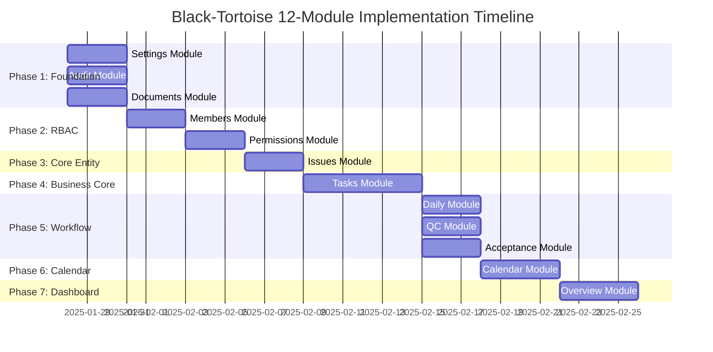

# Module Implementation Phases - Visual Guide

## Quick Reference: 7-Phase Implementation Plan



---

## Phase Dependencies - Topological Order

```
PHASE 1 (Parallel)          PHASE 2 (Sequential)       PHASE 3
┌─────────────┐             ┌─────────────┐            ┌─────────────┐
│  Settings   │             │   Members   │            │   Issues    │
└─────────────┘             └──────┬──────┘            └──────┬──────┘
                                   │                          │
┌─────────────┐                    ▼                          │
│    Audit    │             ┌─────────────┐                  │
└─────────────┘             │ Permissions │                  │
                            └─────────────┘                  │
┌─────────────┐                                              │
│  Documents  │                                              │
└─────────────┘                                              │
                                                             │
        PHASE 4                                              │
    ┌─────────────┐                                         │
    │    Tasks    │◄────────────────────────────────────────┘
    └──────┬──────┘                                          
           │                                                 
           ├──────────┬─────────────┬─────────────┐        
           ▼          ▼             ▼             ▼        
    PHASE 5 (Parallel)                                      
    ┌────────┐  ┌─────────┐  ┌────────────┐               
    │ Daily  │  │   QC    │  │ Acceptance │               
    └────┬───┘  └────┬────┘  └─────┬──────┘               
         │           │              │                       
         └───────────┴──────────────┘                       
                     │                                      
              PHASE 6│                                      
            ┌────────▼───┐                                  
            │  Calendar  │                                  
            └────────┬───┘                                  
                     │                                      
              PHASE 7│                                      
            ┌────────▼───┐                                  
            │  Overview  │                                  
            └────────────┘                                  
```

---

## Layer Implementation Order (Per Module)

```
For EACH module in each phase, implement in this exact order:

┌─────────────────────────────────────────────────────────┐
│ STEP 1: DOMAIN LAYER (Pure TypeScript)                 │
│ ────────────────────────────────────────────────────── │
│ • Entities (business logic, validation)                │
│ • Value Objects (immutable, validated)                 │
│ • Repository Interfaces (contracts only)               │
│ • Domain Events (event classes)                        │
│                                                         │
│ ✅ Validate: tsc --noEmit passes                       │
│ ❌ No framework imports                                │
└─────────────────────────────────────────────────────────┘
                         │
                         ▼
┌─────────────────────────────────────────────────────────┐
│ STEP 2: INFRASTRUCTURE LAYER (External APIs)           │
│ ────────────────────────────────────────────────────── │
│ • Repository Implementations (Firestore)               │
│ • DTOs (wire formats)                                  │
│ • Adapters (external services)                         │
│                                                         │
│ ✅ Validate: Integration tests pass                    │
│ ✅ DTO ↔ Entity mapping correct                        │
└─────────────────────────────────────────────────────────┘
                         │
                         ▼
┌─────────────────────────────────────────────────────────┐
│ STEP 3: APPLICATION LAYER (State & Orchestration)     │
│ ────────────────────────────────────────────────────── │
│ • Enrich signalStore (state, methods)                 │
│ • Event Handlers (subscriptions)                       │
│ • Services (if complex orchestration)                  │
│ • Mappers (DTO → Entity)                              │
│                                                         │
│ ✅ Validate: Store tests pass                          │
│ ✅ Event flow verified                                 │
│ ❌ No manual observables in state                      │
└─────────────────────────────────────────────────────────┘
                         │
                         ▼
┌─────────────────────────────────────────────────────────┐
│ STEP 4: PRESENTATION LAYER (UI Components)            │
│ ────────────────────────────────────────────────────── │
│ • Page Component (route entry)                         │
│ • Feature Components (lists, forms, dialogs)          │
│ • Routes Configuration                                 │
│                                                         │
│ ✅ Validate: Component tests pass                      │
│ ✅ Accessibility checks pass                           │
│ ❌ No business logic in components                     │
└─────────────────────────────────────────────────────────┘
```

---

## Event Flow Matrix (Who Publishes → Who Subscribes)

```
Publisher       Event Name              Subscribers
────────────────────────────────────────────────────────────
Members      → MemberRoleChanged     → Permissions, Audit
Members      → MemberAdded           → Audit, Overview
Members      → MemberRemoved         → Audit, Overview

Permissions  → RoleCreated           → Audit, Overview
Permissions  → PermissionGranted     → Audit

Tasks        → TaskCreated           → Audit, Overview
Tasks        → TaskProgressUpdated   → Daily, Audit, Overview
Tasks        → TaskReadyForQC        → QualityControl
Tasks        → TaskReadyForAcceptance→ Acceptance

QC           → QCPassed              → Tasks, Audit
QC           → QCFailed              → Tasks, Issues, Audit

Acceptance   → AcceptanceApproved    → Tasks, Audit
Acceptance   → AcceptanceRejected    → Tasks, Issues, Audit

Issues       → IssueCreated          → Audit, Overview
Issues       → IssueResolved         → Tasks, Audit

Daily        → DailyEntryCreated     → Audit, Overview

Documents    → DocumentUploaded      → Audit, Overview

Settings     → SettingsChanged       → Audit
Settings     → ModuleToggled         → Audit, Overview

Calendar     → (NO EVENTS PUBLISHED) → N/A

Overview     → (NO EVENTS PUBLISHED) → N/A

Audit        → (NO EVENTS PUBLISHED) → N/A
```

**Key Insight**: Audit and Overview are **pure consumers** (subscribers only).

---

## Critical Path Analysis

### Longest Dependency Chain (Critical Path)
```
Members (3d) → Permissions (3d) → [parallel path merges] →
Tasks (6d) → QC/Acceptance (3d) → Calendar (4d) → Overview (4d)
= ~23 days sequential minimum
```

### Parallelization Wins
- **Phase 1**: 3 modules × 3 days = 9 days → Parallel: **3 days**
- **Phase 5**: 3 modules × 3 days = 9 days → Parallel: **3 days**

**Total Calendar Time** (with parallelization): ~26-28 days  
**Total Sequential Time** (no parallelization): ~38-40 days  
**Efficiency Gain**: ~30% time reduction

---

## Validation Checkpoints

### After Each Phase
```bash
# 1. Compilation Check
pnpm build --strict
# Expected: 0 errors, 0 warnings

# 2. Test Suite
pnpm test
# Expected: All tests pass

# 3. Lint & Format
pnpm lint
pnpm format:check
# Expected: No violations

# 4. Circular Dependencies
npx madge --circular src/app
# Expected: No circular dependencies

# 5. Bundle Size
pnpm build --stats-json
# Expected: < 500KB initial bundle
```

### Manual Validation Checklist
- [ ] Navigate to module route
- [ ] Perform CRUD operations
- [ ] Verify event emissions (check Audit logs)
- [ ] Test cross-module interactions (if applicable)
- [ ] Check accessibility (keyboard nav, ARIA)
- [ ] Test on mobile viewport

---

## Resource Allocation (3-Dev Team)

### Phase 1 (Week 1)
- **Dev A**: Settings Module (Domain → Infra → App → UI)
- **Dev B**: Audit Module (Domain → Infra → App → UI)
- **Dev C**: Documents Module (Domain → Infra → App → UI)

### Phase 2 (Week 2)
- **Dev A**: Members Module (full stack)
- **Dev B**: Permissions Module (starts after Members Domain done)
- **Dev C**: Issues Module (can start early, Phase 3)

### Phase 3 (Week 2-3)
- **Dev C**: Issues Module (continue)

### Phase 4 (Week 3-4)
- **All Devs**: Tasks Module (complex, requires coordination)
  - Dev A: Domain + Infrastructure
  - Dev B: Application (Store + Events)
  - Dev C: Presentation (List, Gantt, Kanban)

### Phase 5 (Week 4-5)
- **Dev A**: Daily Module (full stack)
- **Dev B**: Quality Control Module (full stack)
- **Dev C**: Acceptance Module (full stack)

### Phase 6 (Week 5-6)
- **Dev A**: Calendar Module (full stack)

### Phase 7 (Week 6)
- **Dev B**: Overview Module (full stack)
- **All Devs**: Integration testing, bug fixes

**Total: 6-7 weeks with 3 developers**

---

## Quick Start: Implementing Your First Module

### Example: Settings Module (Phase 1.1)

#### Day 1: Domain Layer
```bash
# Create entity
src/app/domain/entities/workspace-settings.entity.ts

# Create repository interface
src/app/domain/repositories/settings.repository.ts

# Validate
pnpm exec tsc --noEmit --project tsconfig.json
```

#### Day 2: Infrastructure Layer
```bash
# Create DTO
src/app/infrastructure/dto/settings.dto.ts

# Implement repository
src/app/infrastructure/repositories/settings.firestore.repository.ts

# Write integration tests
src/app/infrastructure/repositories/settings.firestore.repository.spec.ts
```

#### Day 3: Application Layer
```bash
# Enrich store
src/app/application/stores/settings.store.ts

# Add event handlers
src/app/application/handlers/settings.event-handlers.ts

# Register events
src/app/application/handlers/event-handler.registry.ts

# Write store tests
src/app/application/stores/settings.store.spec.ts
```

#### Day 4: Presentation Layer
```bash
# Create page component
src/app/presentation/pages/settings-page/settings-page.component.ts

# Create feature components
src/app/presentation/components/settings/
  - general-settings/
  - module-management/
  - notification-preferences/

# Add routes
src/app/app.routes.ts

# Write component tests
src/app/presentation/pages/settings-page/settings-page.component.spec.ts
```

#### Day 5: Integration & Testing
- Manual testing
- Fix bugs
- Accessibility audit
- Update status tracker

---

## Common Pitfalls & Solutions

### ❌ Pitfall 1: Implementing UI Before Domain
**Symptom**: Components referencing non-existent entities  
**Solution**: Always follow Domain → Infra → App → UI order

### ❌ Pitfall 2: Circular Event Dependencies
**Symptom**: Infinite event loops  
**Solution**: Draw event flow diagram BEFORE implementing handlers

### ❌ Pitfall 3: Skipping Store Skeleton Enrichment
**Symptom**: Empty stores, logic in components  
**Solution**: Review existing store, add missing state/methods

### ❌ Pitfall 4: Direct Store-to-Store Dependencies
**Symptom**: `StoreA` injects `StoreB`  
**Solution**: Use EventBus or Application Service orchestration

### ❌ Pitfall 5: Framework Imports in Domain
**Symptom**: `import { Injectable } from '@angular/core'` in entity  
**Solution**: Remove ALL framework imports from `domain/` folder

---

## Success Metrics (Per Phase)

### Phase Completion Criteria
- ✅ All modules in phase: Domain ✓, Infra ✓, App ✓, UI ✓
- ✅ Status tracker updated
- ✅ All tests passing
- ✅ Build succeeds in strict mode
- ✅ Manual smoke test passed
- ✅ Event flows verified (Audit logs)
- ✅ No regressions in previous phases

### Project Completion Criteria
- ✅ All 12 modules operational
- ✅ Full task workflow functional (Create → Daily → QC → Acceptance → Done)
- ✅ Calendar aggregates Tasks + Daily correctly
- ✅ Overview dashboard displays all metrics
- ✅ Audit trail captures all critical events
- ✅ Zero layer violations
- ✅ Sub-200ms UI response times
- ✅ WCAG 2.1 AA compliance

---

**Reference**: See [IMPLEMENTATION_ORDER.md](./IMPLEMENTATION_ORDER.md) for full specification.
