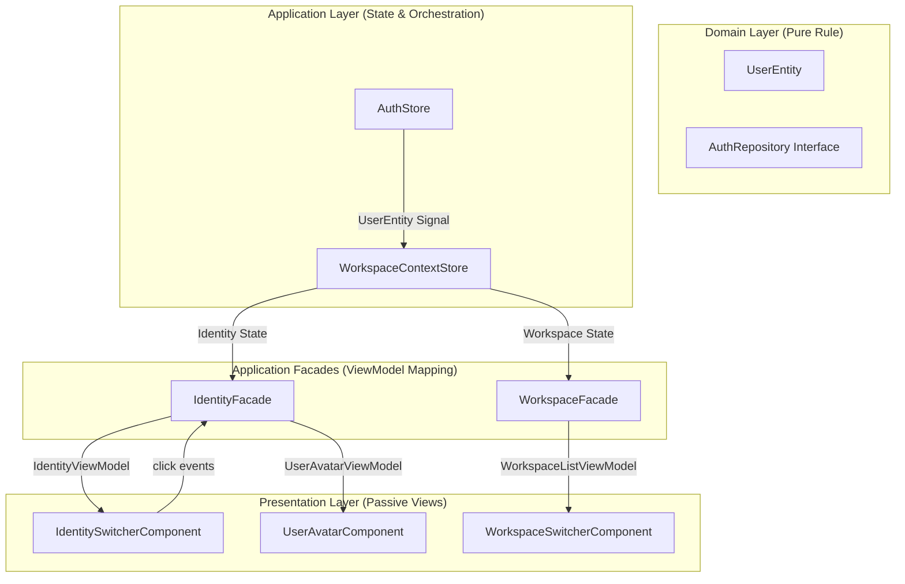

# Authentication & UI Integration Design Specification (DDD Compliant)

## 1. Executive Summary
This document specifies the architectural implementation for integrating the **Authentication System** with the **Global UI Shell** (Header, Identity Switcher, Workspace Switcher).

It adheres strictly to **Domain-Driven Design (DDD)** principles and the project's **Zone-less Angular 20+** architecture. The core mandate is the **strict separation of concerns** where the Presentation Layer never interacts directly with the Domain Layer. Instead, it must consume mapped **ViewModels** provided by the Application Layer.

**Constraint for AI Agents:**
When implementing this specification, do not infer business logic. Follow the data mappings explicitly defined in Section 4. If a field is missing in the ViewModel, add it to the ViewModel definition in the Application Layer; do not attempt to access the Domain Entity directly from the Component.

## 2. DDD Architecture Layer Mapping

| Layer | Component/Service | Responsibility | Scope |
| :--- | :--- | :--- | :--- |
| **Domain** | `UserEntity` | Core business logic and invariants for a user. Contains raw data like `id`, `email`, `organizationId`. | Pure TypeScript (No Angular dependencies) |
| **Domain** | `AuthRepository` | Interface defining authentication contracts (Login, Logout, Register). | Pure TypeScript (No Angular dependencies) |
| **Application** | `AuthStore` | **Single Source of Truth** for detailed Authentication State (Token, User Entity, Loading Status). | Global Singleton (`signalStore`) |
| **Application** | `WorkspaceContextStore` | Orchestrates context (Identity Type, Organization, Active Workspace) based on the Authentication User. | Global Singleton (`signalStore`) |
| **Application** | `IdentityFacade` | Adapts Application State into strict UI `ViewModels`. Responsible for formatting and view logic. | Presentation Adapter |
| **Presentation** | `IdentitySwitcherComponent` | **Passive UI**. Renders `IdentityViewModel` signals. Contains zero business logic. | Dumb Component |
| **Presentation** | `UserAvatarComponent` | **Passive UI**. Renders `UserAvatarViewModel` signals. Contains zero business logic. | Dumb Component |

## 3. Data Flow Architecture

The data flows strictly unidirectionally from Domain up to Presentation.



## 4. Strict View Model Definitions

To prevent "Domain Leakage" into the UI, the Facades must expose specific View Models. Components are **forbidden** from importing or using Domain Entities.

### 4.1 IdentityViewModel
**Consumer:** `IdentitySwitcherComponent`
**Location:** Defined in `src/app/application/models/identity.view-model.ts` (or inline in Facade if simple)

```typescript
export interface IdentityViewModel {
  /** 
   * Determines the visual mode of the switcher.
   * 'personal': Shows user's name.
   * 'organization': Shows organization's name.
   */
  readonly type: 'personal' | 'organization';
  
  /**
   * The text to display in the main label.
   * Logic: Returns Organization Name if type is 'organization', otherwise User Name.
   */
  readonly displayName: string; 
  
  /**
   * Optional label for the role badge (e.g., "Owner", "Admin").
   * Logic: Derived from the user's role in the current context.
   */
  readonly roleLabel?: string; 
  
  /**
   * Whether the user is currently authenticated.
   * Used to show/hide the entire switcher or switch to 'Guest' view.
   */
  readonly isAuthenticated: boolean;
}
```

### 4.2 UserAvatarViewModel
**Consumer:** `UserAvatarComponent`
**Location:** Defined in `src/app/application/models/user-avatar.view-model.ts`

```typescript
export interface UserAvatarViewModel {
  /**
   * Remote URL for the user's profile image.
   * Logic: Returns `user.photoUrl` from AuthStore.
   */
  readonly photoUrl: string | null;
  
  /**
   * Two-character initials for fallback display.
   * Logic: Computed from `displayName` (e.g., "John Doe" -> "JD").
   */
  readonly initials: string; 
  
  /**
   * A CSS color string or class name.
   * Logic: Deterministic generation based on user ID or name hash.
   */
  readonly color: string; 
}
```

## 5. Implementation Specifications

### 5.1 AuthStore (`src/app/application/stores/auth.store.ts`)
*   **Role**: Application State Root for Authentication.
*   **Responsibility**: manages `UserEntity` persistence and Firebase integration.
*   **Constraint**: Must **not** handle "Workspace Context" logic. It strictly answers "Who is the user?", not "Where are they working?".

### 5.2 WorkspaceContextStore (`src/app/application/stores/workspace-context.store.ts`)
*   **Role**: The "Brain" of the Global Shell.
*   **Integration**:
    *   Injects: `AuthStore`.
    *   Logic: Uses `computed()` to observe `AuthStore.user`.
    *   Behavior: 
        *   When `AuthStore.user` changes, it recalculates `currentIdentityType`.
        *   If `AuthStore.user` becomes `null`, it must reset all context signals to default/null.

### 5.3 IdentityFacade (`src/app/application/facades/identity.facade.ts`)
*   **Role**: Adapter / ViewModel Factory.
*   **Strict Mapping Rule**:
    *   **Inputs**: 
        *   `WorkspaceContextStore.currentIdentityType`
        *   `WorkspaceContextStore.currentOrganizationDisplayName`
        *   `AuthStore.user`
    *   **Output**: `Signal<IdentityViewModel>`
*   **Logic**:
    *   `displayName` calculation:
        ```typescript
        // Pseudocode for computed()
        if (context.type() === 'organization') {
           return context.organizationName();
        } else {
           return auth.user()?.displayName || 'Guest';
        }
        ```
    *   `initials` calculation: Must reside here or in a shared utility. **Forbidden** in the HTML template.

### 5.4 IdentitySwitcherComponent (`src/app/presentation/components/identity-switcher.component.ts`)
*   **Architecture**: Dumb / Presentational Component.
*   **Constraint**: 
    *   **Forbidden Imports**: `@domain/*`, `@application/stores/*`.
    *   **Allowed Imports**: `@application/facades/*` only.
*   **Template Restriction**:
    ```html
    <!-- Correct Usage: Using the ViewModel property -->
    <span>{{ viewModel().displayName }}</span>
    
    <!-- Forbidden Usage: Drilling into the store or entity -->
    <span>{{ authStore.user().organization.name }}</span> <!-- VIOLATION: Coupling logic in template -->
    ```

## 6. Verification Checklist (Definition of Done)

### Architecture Compliance
- [ ] **Import Check**: UI Components must NOT import `AuthStore` or `WorkspaceContextStore`.
- [ ] **Type Check**: UI Components must NOT use `UserEntity` in Input/Output types.
- [ ] **Facade Check**: `IdentityFacade` must return mapped `IdentityViewModel` and `UserAvatarViewModel` signals, not raw objects.

### Functionality Verification
- [ ] **Login Flow**: Logging in updates `AuthStore` -> `WorkspaceContextStore` -> Header automatically updates.
- [ ] **Context Switch**: The user is mapped to 'Personal' or 'Organization' correctly in `IdentitySwitcherComponent`.
- [ ] **Avatar Fallback**: Displays Initials correctly if `photoUrl` is missing.
- [ ] **Logout Flow**:
    1.  User clicks "Sign Out".
    2.  `IdentityFacade.signOut()` is called.
    3.  `AuthStore.user` becomes null.
    4.  Router redirects to Landing Page (`/`).
    5.  Header UI reverts to hidden/guest state.

### Code Quality
- [ ] **Strict Typing**: No `any` types used.
- [ ] **Zone-less**: Components use `ChangeDetectionStrategy.OnPush` and signals.
- [ ] **Test Coverage**: Unit tests exist for `IdentityFacade` to verify ViewModel mapping logic.
