# Architecture Analysis - Index

**Project**: Black-Tortoise  
**Analysis Date**: 2025-01-23  
**Architecture**: DDD + Clean Architecture + Zone-less Angular 20+

---

## 📋 Analysis Summary

This analysis provides a comprehensive review of the Black-Tortoise repository's architectural health, dependency map, and layer boundary violations.

**Key Findings**:
- ✅ **99.2% Compliance** with Clean Architecture principles
- ✅ **130 files analyzed** across 4 layers
- ⚠️ **2 minor violations** identified (both fixable)
- ✅ **Grade A (Excellent)** overall architecture

---

## 📚 Generated Reports

### 1. **Black-Tortoise_Architecture.md** (32 KB) - **MAIN REPORT**
   
**Purpose**: Comprehensive architectural documentation with diagrams and analysis

**Contents**:
- Executive Summary
- System Context Diagram
- Component Architecture Diagram
- Deployment Architecture Diagram
- Data Flow Diagram
- Key Workflow Sequence Diagrams
- Dependency Map Visualization
- NFR Analysis (Scalability, Performance, Security, Reliability, Maintainability)
- Risks and Mitigations
- Technology Stack Recommendations
- Next Steps

**Who Should Read**: Architects, Tech Leads, Senior Developers, Stakeholders

---

### 2. **ARCHITECTURE_VIOLATIONS_REPORT.md** (11 KB) - **VIOLATIONS DETAIL**

**Purpose**: Detailed list of all architectural violations with remediation guidance

**Contents**:
- Executive Summary
- Layer Statistics
- Dependency Rules
- Detailed Violation Descriptions (2 violations)
- Offending Files List
- Remediation Plan (3 phases)
- Comparison with Previous Report
- Success Criteria

**Who Should Read**: Development Team, Code Reviewers, QA

---

### 3. **DEPENDENCY_MAP_SUMMARY.md** (7 KB) - **QUICK REFERENCE**

**Purpose**: Quick reference guide for layer dependencies and violations

**Contents**:
- Layer Distribution (visual bar chart)
- Dependency Flow (ASCII diagram)
- Violations Summary (2 total)
- Valid Dependencies Report
- Layer Rules
- Quick Fix Commands
- File-by-File Analysis
- Architectural Health Score

**Who Should Read**: Daily reference for all developers

---

## 🎯 Key Metrics

```
┌─────────────────────────────────────────────────────┐
│          ARCHITECTURAL HEALTH DASHBOARD             │
├─────────────────────────────────────────────────────┤
│                                                     │
│  Overall Grade:              A (Excellent)          │
│  Compliance Rate:            99.2%                  │
│  Files Analyzed:             130                    │
│  Violations Found:           2                      │
│  Violations Fixed:           28 (from previous)     │
│  Improvement:                +93%                   │
│                                                     │
│  Layer Distribution:                                │
│    - Domain:                 34 files (26.2%)       │
│    - Application:            17 files (13.1%)       │
│    - Infrastructure:          3 files ( 2.3%)       │
│    - Presentation:           76 files (58.5%)       │
│                                                     │
│  Valid Dependencies:         98.5% of all imports   │
│  Estimated Fix Time:         1-2 hours              │
│                                                     │
└─────────────────────────────────────────────────────┘
```

---

## 🔴 Active Violations (2)

### Violation #1: Application → Presentation
- **File**: `application/workspace/workspace.facade.ts`
- **Line**: 19
- **Import**: `PresentationStore` from `@presentation/shared`
- **Fix**: Move to Application layer

### Violation #2: Application → Presentation  
- **File**: `application/facades/header.facade.ts`
- **Line**: 19
- **Import**: `WorkspaceCreateResult` from `@presentation/workspace/models/...`
- **Fix**: Move to Application layer

---

## ✅ Major Achievements

Compared to the previous analysis (see `DDD_BOUNDARY_VIOLATIONS_REPORT.md`):

| Metric | Previous | Current | Change |
|--------|----------|---------|--------|
| **Total Violations** | 30 | 2 | **-93%** ✅ |
| Application → Infrastructure | 1 | 0 | **FIXED** ✅ |
| Presentation → Infrastructure | 1 | 0 | **FIXED** ✅ |
| Presentation → Domain | 28 | 0 | **FIXED** ✅ |
| Application → Presentation | 0 | 2 | NEW ⚠️ |
| **Compliance Rate** | 76.9% | 99.2% | **+22.3%** ✅ |

**Conclusion**: The codebase has been successfully refactored with massive improvements!

---

## 📊 Dependency Map

```mermaid
graph TB
    subgraph "Black-Tortoise Architecture"
        D[Domain Layer<br/>34 files<br/>Pure Business Logic]
        A[Application Layer<br/>17 files<br/>Use Cases & Facades]
        I[Infrastructure Layer<br/>3 files<br/>External Services]
        P[Presentation Layer<br/>76 files<br/>UI Components]
    end

    A -->|✓ 11 imports| D
    I -->|✓ 4 imports| D
    I -->|✓ 1 import| A
    P -->|✓ 40 imports| A
    A -.->|✗ 2 imports<br/>VIOLATION| P

    classDef valid fill:#51cf66,stroke:#2f9e44,stroke-width:2px
    classDef violation fill:#ff6b6b,stroke:#c92a2a,stroke-width:3px
    
    class D,I,P valid
    class A violation
```



---

## 🛠️ Quick Remediation

To fix all violations:

```bash
# 1. Move PresentationStore to Application layer
git mv src/app/presentation/shared/stores/presentation.store.ts \
       src/app/application/stores/presentation.store.ts

# 2. Move WorkspaceCreateResult model to Application layer
mkdir -p src/app/application/models
git mv src/app/presentation/workspace/models/workspace-create-result.model.ts \
       src/app/application/models/workspace-create-result.model.ts

# 3. Update imports in affected files
#    - application/workspace/workspace.facade.ts (line 19)
#    - application/facades/header.facade.ts (line 19)
#    - Any presentation components using these imports

# 4. Re-run analysis to verify
# (Run the Python analysis script again)
```

---

## 📖 How to Use This Analysis

### For Architects & Tech Leads
1. **Start with**: `Black-Tortoise_Architecture.md` for full architectural overview
2. **Review**: NFR analysis sections for system quality attributes
3. **Plan**: Use Next Steps section for roadmap planning

### For Developers
1. **Daily Reference**: Use `DEPENDENCY_MAP_SUMMARY.md`
2. **Code Reviews**: Check `ARCHITECTURE_VIOLATIONS_REPORT.md`
3. **Before Making Changes**: Verify layer rules in summary document

### For New Team Members
1. **Understand System**: Read System Context and Component diagrams
2. **Learn Patterns**: Review sequence diagrams for key workflows
3. **Coding Standards**: Study layer rules and valid dependency patterns

### For QA & Code Reviewers
1. **Violation Checklist**: Use the 2 active violations as review criteria
2. **Testing Strategy**: Reference NFR sections for test scenarios
3. **Quality Gates**: Enforce 100% compliance before merging

---

## 🎓 Layer Rules Quick Reference

```typescript
// ✅ ALLOWED DEPENDENCIES

Domain Layer:
  - NO dependencies on any layer
  - Pure TypeScript only

Application Layer:
  - Can import from: @domain/*
  - Cannot import from: @infrastructure/*, @presentation/*

Infrastructure Layer:
  - Can import from: @domain/*, @application/*
  - Cannot import from: @presentation/*

Presentation Layer:
  - Can import from: @application/*
  - Cannot import from: @domain/*, @infrastructure/*
```

---

## 🔄 Next Analysis

**When to Re-run**:
- After fixing the 2 violations (expected: 100% compliance)
- Before major releases
- Quarterly architecture reviews
- When adding new layers or major features

**How to Re-run**:
```bash
# Use the Python analysis script
python3 /tmp/full_dependency_analysis.py
```

---

## 📞 Support & References

### Documentation
- **Clean Architecture**: Robert C. Martin - "Clean Architecture: A Craftsman's Guide to Software Structure and Design"
- **DDD**: Eric Evans - "Domain-Driven Design: Tackling Complexity in the Heart of Software"
- **Angular Architecture**: [Angular.dev](https://angular.dev) - Official Angular documentation

### Internal Resources
- Previous Analysis: `DDD_BOUNDARY_VIOLATIONS_REPORT.md`
- DDD Architecture: `DDD_ARCHITECTURE_DIAGRAM.md`
- Presentation Layer: `PRESENTATION_ARCHITECTURE.md`

### External Resources
- [Clean Architecture Blog](https://blog.cleancoder.com/uncle-bob/2012/08/13/the-clean-architecture.html)
- [DDD Reference](https://www.domainlanguage.com/ddd/)
- [Angular Signals](https://angular.dev/guide/signals)

---

## ✅ Validation Checklist

Before marking analysis complete:

- [x] All 130 TypeScript files analyzed
- [x] Layer distribution calculated
- [x] All imports checked against rules
- [x] Violations identified and documented
- [x] Remediation plans created
- [x] Diagrams generated (Mermaid)
- [x] Comparison with previous report
- [x] NFR analysis completed
- [x] Quick reference guide created
- [x] Index document prepared

---

**Analysis Complete** ✅  
**Documents Generated**: 4 (Main report + Violations + Summary + Index)  
**Total Documentation**: ~51 KB  
**Status**: Ready for review and remediation

---

**Generated By**: Automated Architecture Analysis Tool  
**Version**: 1.0  
**Last Updated**: 2025-01-23
